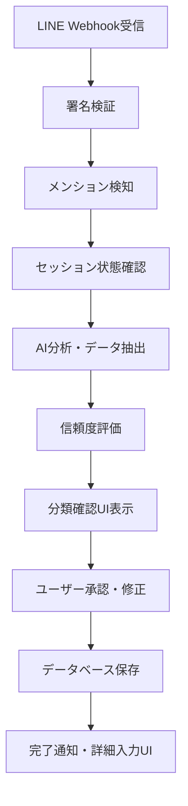

# 🔧 LINEボットリファクタリング - エンジニア事前準備プロンプト

**目的**: 全エンジニアが共通の知識基盤を持って安定した開発を行えるようにする  
**対象**: LINEボットリファクタリングに参加する全エンジニア  
**前提**: Claude Code使用、手動LINEテストベースの開発

---

## 🎯 このプロンプトで身につける知識

✅ **システム全体アーキテクチャの理解**  
✅ **LINEボット動作フローの把握**  
✅ **開発環境の適切なセットアップ**  
✅ **重複コード問題の現状認識**  
✅ **リファクタリング方針の理解**  

---

## 📋 **Step 1: 必須ドキュメント確認**

### 作業指示
以下のドキュメントを**順番に**読み込んで、プロジェクトの全体像を把握してください。

```bash
# 必須読み込みファイル（優先順）
1. docs/essential/CLAUDE.md                    # 開発ナレッジベース
2. docs/active/current/LINE_REFACTORING_PLAN_WITH_MANUAL_TESTING.md  # リファクタリング計画
3. docs/essential/UNIVERSAL_DEVELOPMENT_GUIDE.md  # 開発ガイド
4. package.json                                # プロジェクト構成
5. prisma/schema.prisma                        # データベーススキーマ
```

### 確認ポイント
- [ ] プロジェクトの主要機能（AI分類・セッション管理・リッチUI）
- [ ] 27,000行のコードベース構成
- [ ] 20テーブルのデータベース設計
- [ ] Next.js + TypeScript + Prisma技術スタック

---

## 🏗️ **Step 2: システムアーキテクチャ理解**

### LINEボットの核心構成
```
src/app/api/webhook/line/route.ts (1,468行)
├── Webhookエンドポイント（GET/POST）
├── LINE署名検証（HMAC-SHA256）
├── AI統合処理（Gemini API）
├── セッション管理（インメモリ）
└── データベース保存処理

src/lib/line/notification.ts (2,093行)  
├── Flexメッセージ生成
├── リッチUI作成（ボタン・カルーセル）
├── LINE API送信処理
└── エラーハンドリング
```

### 重要な理解ポイント
**AI-First設計**: 手動入力を最小化し、AIによる自動分類・抽出を最大化  
**セッション継続**: 30分タイムアウト、データ引き継ぎ、段階的入力  
**エラー回復**: 信頼度チェック、再分類UI、フォールバック処理

### 作業指示  
以下のファイルの役割と主要機能を把握してください：

```bash
# LINEボット関連の主要ファイル
src/app/api/webhook/line/route.ts      # メインWebhook処理
src/lib/line/notification.ts           # メッセージ・UI生成
src/lib/line/session-manager.ts        # セッション管理
src/lib/line/datetime-parser.ts        # 日時解析
src/lib/line/text-extraction.ts        # テキスト抽出
```

---

## 🔄 **Step 3: 動作フロー理解**

### LINEメッセージ処理の流れ


### 7つのデータ分類
```typescript
const TYPE_MAP = {
  personal_schedule: '📅 予定',
  schedule: '🎯 イベント', 
  task: '📋 タスク',
  project: '📊 プロジェクト',
  contact: '👤 人脈',
  appointment: '📅 アポイントメント',
  memo: '📝 メモ・ナレッジ'
};
```

### 作業指示
以下のコマンドでログファイルを確認し、実際の処理フローを観察してください：

```bash
# ログファイル確認
tail -f webhook.log                    # Webhookログ
tail -f server.log                     # サーバーログ
```

---

## 🛠️ **Step 4: 開発環境セットアップ**

### 前提条件の確認
```bash
# Node.js, npm, ngrokがインストール済みか確認
node --version     # v18以上推奨
npm --version      # v8以上
ngrok version      # v3以上
```

### 環境変数設定
`.env.local`ファイルを作成し、以下を設定：

```env
# LINE Bot設定（必須）
LINE_CHANNEL_SECRET=your_channel_secret
LINE_CHANNEL_ACCESS_TOKEN=your_channel_access_token

# AI統合（必須）
GOOGLE_AI_API_KEY=your_gemini_api_key

# データベース（既存のものを使用）
DATABASE_URL=file:./data/app.db
```

### 開発サーバー起動
```bash
# 自動セットアップスクリプト使用
npm run line:setup

# または手動セットアップ
npm run dev        # 開発サーバー起動
npm run line:ngrok # ngrokトンネル作成（別ターミナル）
```

### 作業指示
**重要**: 開発作業前に必ず以下を実行してください：

```bash
# 既存Next.jsプロセス終了（重要！）
ps aux | grep next | grep -v grep
pkill -f "next dev"

# 依存関係インストール
npm install

# Prismaクライアント生成
npx prisma generate

# 開発環境起動
npm run line:setup
```

---

## 🎯 **Step 5: プロジェクト現状把握**

### ✅ Phase 1完了済み（2025-06-18）
**コミットID**: `61820fa` - "Phase 1完了: LINEボット重複コード解消・共通定数統一"

### ✅ Phase 2完了済み（2025-06-19）
**コミットID**: `622d9cc` - "Phase 2完了: notification.ts分割・責任分離アーキテクチャ実装"

#### Phase 1完了した修正
- [x] **typeMap重複解消**: 5箇所→1箇所統一（48行削減）
- [x] **convertPriority重複解消**: 2箇所→1箇所統一
- [x] **共通定数ファイル作成**: `src/lib/constants/line-types.ts`
- [x] **共通ユーティリティ作成**: `src/lib/utils/line-helpers.ts`
- [x] **緊急修正完了**: アポイントメント「📝 データ」→「📅 アポイントメント」

#### Phase 1テスト結果
- [x] 全6データタイプで正常動作確認
- [x] 「📝 データ」表示問題完全解決
- [x] エラーゼロ、全機能正常

#### Phase 2完了した修正
- [x] **巨大ファイル分割**: notification.ts (2,055行) → 95行 (95%削減)
- [x] **責任分離実装**: 4つの専門ファイルに機能分割
- [x] **保守性向上**: 単一責任原則・依存関係整理・テスト容易性確保
- [x] **後方互換性**: 既存route.ts修正不要・全エクスポート関数利用可能
- [x] **品質確認**: ビルド成功・型エラー修正済み

#### Phase 2分割結果
```
notification.ts (2,055行) → 95行 (95%削減)
├── line-sender.ts (246行) - 送信・通信機能
├── line-messages.ts (173行) - 基本メッセージ生成
├── line-flex-ui.ts (740行) - Flexメッセージ・UI生成
└── line-menu.ts (736行) - メニュー・フォーム生成
```

### 🔄 Phase 3の対象検討

#### route.ts肥大化問題（検討中）
- **ファイルサイズ**: 1,468行（分割検討対象）
- **責任混在**: Webhook処理・セッション管理・ポストバック処理が混在
- **保守困難**: 単一ファイルでの複数責任

### 次回検討事項
- [ ] **Webhook処理分離**: メイン処理の整理
- [ ] **セッション管理分離**: session-processor.ts検討
- [ ] **ポストバック処理分離**: postback-processor.ts検討
- [ ] **手動テスト**: Phase 2動作確認完了後に判断

---

## 🚀 **Step 6: リファクタリング方針の理解**

### 5段階フェーズ計画
```
✅ Phase 1: 共通定数ファイル作成【完了 2025-06-18】
├── ✅ typeMap統一 → /src/lib/constants/line-types.ts
└── ✅ convertPriority統一 → /src/lib/utils/line-helpers.ts

✅ Phase 2: notification.ts分割【完了 2025-06-19】
├── ✅ line-messages.ts (173行) - 基本メッセージ生成
├── ✅ line-flex-ui.ts (740行) - Flexメッセージ・UI生成
├── ✅ line-sender.ts (246行) - 送信・通信機能
└── ✅ line-menu.ts (736行) - メニュー・フォーム生成

⏳ Phase 3: route.ts責任分離【検討中】
├── webhook-handler.ts  # Webhook処理
├── session-processor.ts # セッション管理
└── postback-processor.ts # ポストバック処理

⏳ Phase 4: エラーハンドリング強化【予定】
⏳ Phase 5: 最終統合テスト【予定】
```

### テスト駆動アプローチ
- **手動LINEテスト**: 各フェーズ後に実機テスト実施
- **テスト指示**: 具体的なLINEメッセージとチェックポイント提供
- **ログ分析**: webhook.log確認による問題特定

---

## 🧪 **Step 7: テスト環境理解**

### テスト実行方式
1. **エンジニア**: コード修正・ローカル確認
2. **プロジェクトオーナー**: LINE実機テスト実行
3. **エンジニア**: ログ分析・問題修正
4. **共同**: 次フェーズ進行判定

### テストパターン例
```
✅ Phase 1テスト（完了済み）：
1. 「明日14時に歯医者」送信 → ✅ 「📅 予定」正常表示
2. 「田中さんと会議」送信 → ✅ 「📅 アポイントメント」正常表示  
3. 「📝 データ」が表示されないことを確認 → ✅ 完全解決

⏳ Phase 2テスト（次のエンジニア実行予定）：
1. 全メニュー機能の動作確認
2. Flexメッセージの正常生成・送信
3. エラーケースでの適切な処理
4. セッション管理の継続性確認

【Phase 2実装状況】
✅ コード分割完了・ビルド成功確認済み
⏳ 手動LINEテスト待ち（次のエンジニア担当）
```

### 作業指示
以下のテストコマンドを理解し、実行準備をしてください：

```bash
# ログリアルタイム監視
tail -f webhook.log | grep "🔍 DEBUG"

# 特定パターン検索  
grep "Session type mismatch" webhook.log

# エラー検索
grep "ERROR\|error" server.log
```

---

## ✅ **Step 8: 知識チェックリスト**

### 確認必須項目
作業開始前に以下をすべて理解・準備してください：

#### システム理解
- [ ] LINEボットの主要3ファイル（route.ts, notification.ts, session-manager.ts）の役割
- [ ] AI分類の7つのタイプとtypeMapの対応
- [ ] セッション管理の仕組み（30分タイムアウト、継続性）
- [ ] データベースの主要テーブル（users, tasks, appointments等）

#### 開発環境
- [ ] .env.localファイルが正しく設定済み
- [ ] ngrokとLINE Developers Consoleの連携確認
- [ ] `npm run line:setup`が正常実行される
- [ ] ローカルでLINEメッセージ送受信が動作する

#### Phase 1成果理解
- [ ] 共通定数ファイル（line-types.ts）の構造理解
- [ ] 共通ユーティリティ（line-helpers.ts）の機能理解  
- [ ] typeMap・convertPriority統一の効果理解
- [ ] 「📝 データ」→「📅 アポイントメント」修正内容理解

#### Phase 2対象理解
- [ ] notification.ts（2093行）の18個の関数分担
- [ ] Flexメッセージ生成・送信・UI作成の責任混在
- [ ] ファイル分割による保守性向上効果
- [ ] 手動LINEテストによる品質確認手法

---

## 🎯 **Step 9: 最初の実習課題**

### 事前準備確認作業
以下の課題を実行し、準備完了を確認してください：

#### 課題A: Phase 1・2成果確認
```bash
# 1. Phase 1で作成された共通ファイル確認
ls -la src/lib/constants/line-types.ts
ls -la src/lib/utils/line-helpers.ts

# 2. Phase 2で分割されたファイル確認
ls -la src/lib/line/line-*.ts
wc -l src/lib/line/notification.ts src/lib/line/line-*.ts

# 3. 現在のログ状態確認
tail -n 20 webhook.log
```

#### 課題B: Phase 1・2成果の動作確認
```
🧪 Phase 1・2成果確認：
1. ローカル環境でLINEボット起動
2. LINEで「田中さんとの会議」送信（アポイントメントテスト）
3. 「📅 アポイントメント」と正しく表示されることを確認
4. 「📝 データ」が表示されないことを確認
5. 修正UIカルーセル・メニュー機能の動作確認
```

#### 課題C: Phase 2分割後コード理解
以下のファイルの主要機能を説明できるようになること：
- `src/lib/line/notification.ts` - re-exportメインファイル（95行）
- `src/lib/line/line-sender.ts` - 送信・通信機能（246行）
- `src/lib/line/line-messages.ts` - 基本メッセージ生成（173行）
- `src/lib/line/line-flex-ui.ts` - Flexメッセージ・UI生成（740行）
- `src/lib/line/line-menu.ts` - メニュー・フォーム生成（736行）
- `src/lib/constants/line-types.ts` - 共通定数の構造
- `src/lib/utils/line-helpers.ts` - 共通ユーティリティの機能

---

## 🚀 **Step 10: 作業開始準備**

### 現在の状況確認
- [x] **Phase 1完了**: 共通定数・ユーティリティファイル作成済み（2025-06-18）
- [x] **Phase 2完了**: notification.ts分割・責任分離実装済み（2025-06-19）
- [ ] **Phase 2テスト**: 手動LINEテスト実行待ち（次のエンジニア担当）

### Git状況確認
```bash
# 完了済みコミット確認
git log --oneline -5
# 期待結果：
# 2a42d7c docs: Phase 2完了・進捗報告更新
# 622d9cc Phase 2完了: notification.ts分割・責任分離アーキテクチャ実装
# 61820fa Phase 1完了: LINEボット重複コード解消・共通定数統一
```

### 次の作業選択肢
#### 選択肢A: Phase 2手動テスト実行
✅ **推奨**: Phase 2で分割した機能の動作確認
- 手動LINEテスト実行
- 全メニュー機能動作確認
- Flexメッセージ・UI正常表示確認
- セッション管理継続性確認

#### 選択肢B: Phase 3検討・計画
route.ts（1,468行）の責任分離検討
- Webhook処理分離の計画
- セッション管理分離の設計
- ポストバック処理分離の検討

#### Phase 2テスト開始前の確認事項
- [x] Phase 1完了コミット（61820fa）が存在する
- [x] Phase 2完了コミット（622d9cc）が存在する
- [x] 分割ファイル4個が正常存在する
- [x] ビルド・型チェック成功確認済み
- [ ] 手動LINEテスト環境が準備完了している
- [ ] `docs/active/current/PHASE2_COMPLETION_REPORT.md`のテスト手順確認済み

---

## 📞 **サポート・エスカレーション**

### 困った時の対応
1. **ログ確認**: `tail -f webhook.log`でリアルタイム監視
2. **環境リセット**: `pkill -f "next dev"` + `npm run line:setup`
3. **ドキュメント再確認**: `docs/essential/CLAUDE.md`のトラブルシューティング
4. **プロジェクトオーナー相談**: 理解困難な仕様・要件の確認

### 🎯 成功への鍵
- **段階的進行**: 一度に大きな変更をせず、フェーズごとに確実に
- **テスト重視**: 毎回のLINE実機テストで問題早期発見
- **ログ活用**: 詳細ログで問題の根本原因を特定
- **コミュニケーション**: 不明点は遠慮なく確認・相談

---

**🎉 Phase 2完了！次のエンジニアは手動LINEテストまたはPhase 3検討を実行してください！**

---

## 📋 **Phase 2完了サマリー**

**✅ 達成済み:**
- notification.ts巨大ファイル問題解決（2,055行→95行、95%削減）
- 4つの専門ファイルに責任分離実装
- 単一責任原則・依存関係整理・テスト容易性確保
- 後方互換性維持・ビルド成功・品質確認完了

**⏳ 次のステップ:**
- Phase 2手動LINEテスト実行（推奨）
- Phase 3検討・計画（option）

**📋 参考資料:**
- `docs/active/current/PHASE2_COMPLETION_REPORT.md` - 完了報告・テスト手順
- `docs/active/current/LINE_REFACTORING_PLAN_WITH_MANUAL_TESTING.md` - 全体計画