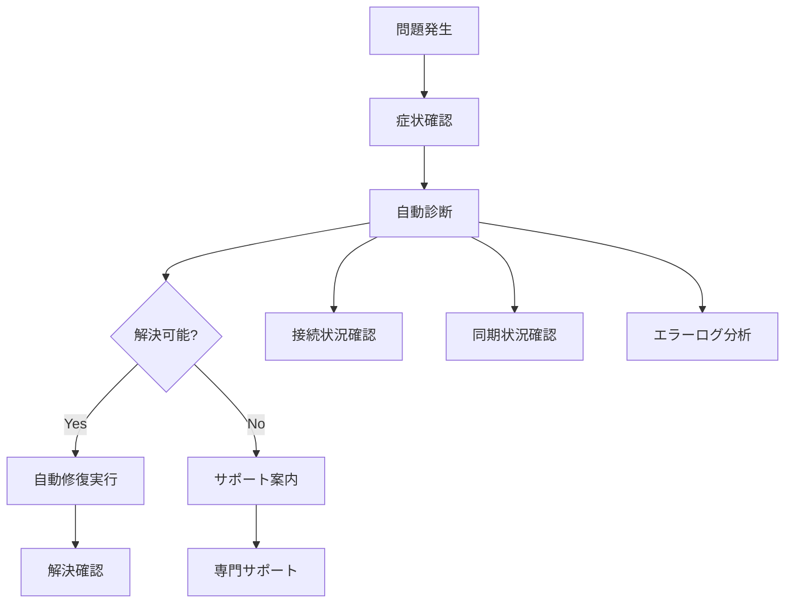
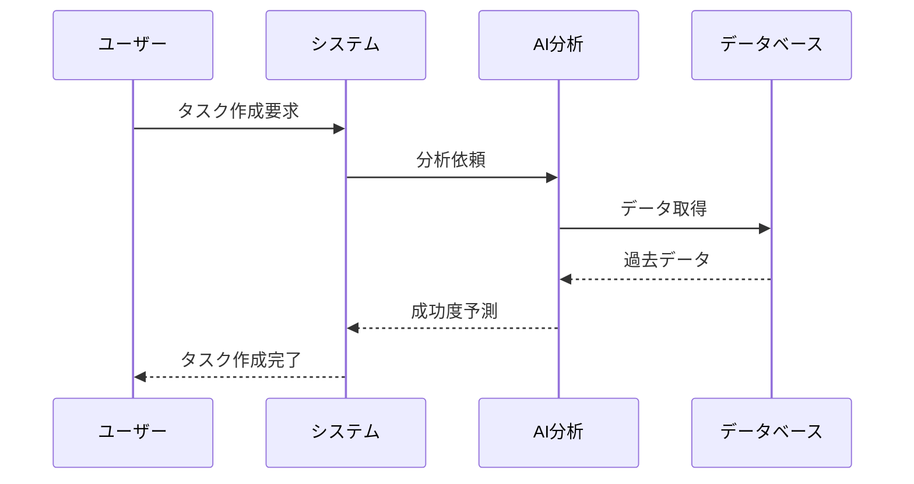
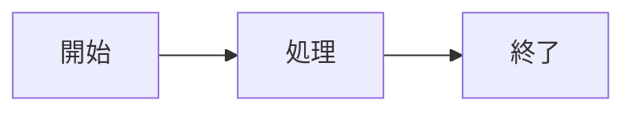

# Mermaid図表テスト

## フローチャート例

```mermaid
graph TD
    A[問題発生] --> B[症状確認]
    B --> C[自動診断]
    C --> D{解決可能?}
    D -->|Yes| E[自動修復実行]
    D -->|No| F[サポート案内]
    E --> G[解決確認]
    F --> H[専門サポート]
    
    C --> C1[接続状況確認]
    C --> C2[同期状況確認]
    C --> C3[エラーログ分析]
```

## シーケンス図例

```mermaid
sequenceDiagram
    participant U as ユーザー
    participant S as システム
    participant A as AI分析
    participant D as データベース

    U->>S: タスク作成要求
    S->>A: 分析依頼
    A->>D: データ取得
    D-->>A: 過去データ
    A-->>S: 成功度予測
    S-->>U: タスク作成完了
```

## 簡単なフロー

```mermaid
graph LR
    A[開始] --> B[処理] --> C[終了]
```