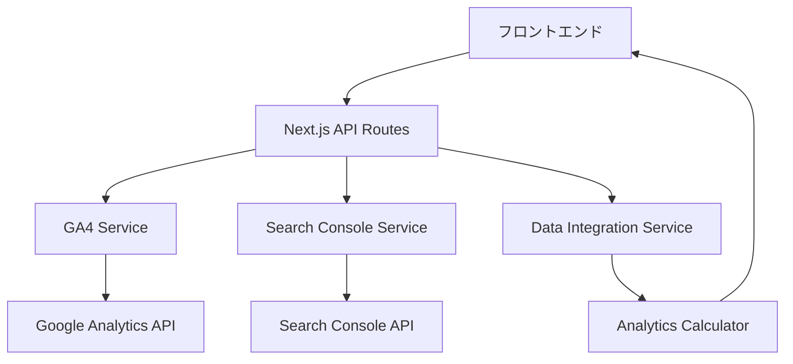

# 技術仕様書　GA4統合分析ダッシュボード

## 📋 システム概要

GA4 Data API と Search Console API を活用したデジタルマーケティング分析システムの詳細技術仕様

---

## 🛠 技術スタック

### フロントエンド
- **Next.js 15.3.3** (既存システム準拠)
- **TypeScript 5** (既存システム準拠)
- **React 19** (既存システム準拠)
- **Tailwind CSS 4** (既存システム準拠)
- **Recharts 2.15.3** (既存システム活用)

### バックエンド
- **Node.js** API Routes (Next.js)
- **@google-analytics/data** (公式SDK)
- **googleapis** (Search Console API)
- **google-auth-library** (認証)

### データベース
- **なし** (APIからのリアルタイム取得のみ)
- **メモリキャッシュ** (パフォーマンス向上)

---

## 🔧 データフロー設計



---

## 📊 API仕様

### 1. ダッシュボードデータ取得

**エンドポイント:** `GET /api/analytics/dashboard`

**パラメータ:**
```typescript
interface DashboardParams {
  days?: number;           // 期間 (デフォルト: 30)
  realtime?: boolean;      // リアルタイムデータ含む
  metrics?: string[];      // 取得メトリクス
  dimensions?: string[];   // 取得ディメンション
}
```

**レスポンス:**
```typescript
interface DashboardResponse {
  success: boolean;
  data: {
    overview: OverviewMetrics;
    traffic: TrafficData;
    conversions: ConversionData;
    pages: PagePerformanceData[];
    seo: SEOData;
    realtime?: RealtimeData;
    insights: Insight[];
  };
  timestamp: string;
  dateRange: DateRange;
}
```

### 2. リアルタイムデータ取得

**エンドポイント:** `GET /api/analytics/realtime`

**レスポンス:**
```typescript
interface RealtimeResponse {
  success: boolean;
  data: {
    activeUsers: number;
    pageViews: number;
    topPages: Array<{
      pagePath: string;
      activeUsers: number;
    }>;
    deviceBreakdown: Array<{
      deviceCategory: string;
      activeUsers: number;
    }>;
    geoBreakdown: Array<{
      country: string;
      activeUsers: number;
    }>;
  };
  timestamp: string;
}
```

### 3. 期間比較データ

**エンドポイント:** `GET /api/analytics/comparison`

**パラメータ:**
```typescript
interface ComparisonParams {
  currentStart: string;    // YYYY-MM-DD
  currentEnd: string;      // YYYY-MM-DD
  previousStart: string;   // YYYY-MM-DD
  previousEnd: string;     // YYYY-MM-DD
}
```

---

## 🔐 認証仕様

### サービスアカウント設定
```typescript
// config/auth-config.ts
export const AUTH_CONFIG = {
  keyFilename: process.env.GOOGLE_APPLICATION_CREDENTIALS,
  scopes: [
    'https://www.googleapis.com/auth/cloud-platform',
    'https://www.googleapis.com/auth/analytics.readonly',
    'https://www.googleapis.com/auth/webmasters.readonly'
  ],
  subject: process.env.GOOGLE_SERVICE_ACCOUNT_EMAIL
};
```

### 環境変数
```env
# 必須
GA4_PROPERTY_ID=123456789
GOOGLE_APPLICATION_CREDENTIALS=/path/to/service-account-key.json
GSC_SITE_URL=https://example.com

# オプション
GOOGLE_SERVICE_ACCOUNT_EMAIL=service@project.iam.gserviceaccount.com
ANALYTICS_CACHE_TTL=300
ANALYTICS_MAX_RETRIES=3
```

---

## 📈 データモデル

### 基本メトリクス
```typescript
interface OverviewMetrics {
  // トラフィック
  sessions: number;
  users: number;
  newUsers: number;
  pageViews: number;
  
  // エンゲージメント
  averageSessionDuration: number;
  bounceRate: number;
  pagesPerSession: number;
  
  // コンバージョン
  conversions: number;
  conversionRate: number;
  revenue: number;
  
  // SEO
  organicSessions: number;
  organicConversions: number;
  averagePosition: number;
  
  // 計算済み
  growthRate: number;
  trend: 'up' | 'down' | 'stable';
  
  // 時系列データ
  dailyTrend: Array<{
    date: string;
    users: number;
    sessions: number;
    pageViews: number;
    conversions: number;
  }>;
}
```

### ページパフォーマンス
```typescript
interface PagePerformanceData {
  pagePath: string;
  pageTitle?: string;
  
  // GA4 メトリクス
  screenPageViews: number;
  uniquePageViews: number;
  averageTimeOnPage: number;
  exitRate: number;
  bounceRate: number;
  
  // Search Console メトリクス
  organicClicks: number;
  impressions: number;
  ctr: number;
  avgPosition: number;
  
  // 計算済みメトリクス
  seoEfficiency: number;      // オーガニック効率
  trafficQuality: number;     // トラフィック品質
  conversionValue: number;    // コンバージョン価値
  
  // トレンド
  trend: {
    pageViews: number;        // 前期比
    position: number;         // 順位変動
    clicks: number;           // クリック変動
  };
}
```

### SEOデータ
```typescript
interface SEOData {
  overview: {
    totalClicks: number;
    totalImpressions: number;
    averageCTR: number;
    averagePosition: number;
  };
  
  topQueries: Array<{
    query: string;
    clicks: number;
    impressions: number;
    ctr: number;
    position: number;
  }>;
  
  topPages: Array<{
    page: string;
    clicks: number;
    impressions: number;
    ctr: number;
    position: number;
  }>;
  
  deviceBreakdown: Array<{
    device: 'mobile' | 'desktop' | 'tablet';
    clicks: number;
    impressions: number;
    ctr: number;
    position: number;
  }>;
  
  countryBreakdown: Array<{
    country: string;
    clicks: number;
    impressions: number;
    ctr: number;
    position: number;
  }>;
}
```

---

## 🎯 パフォーマンス仕様

### レート制限対応
```typescript
class RateLimiter {
  private tokens: number = 50000;  // 1時間制限
  private requests: number = 0;    // 同時リクエスト
  private maxRequests: number = 50;
  
  async executeWithRateLimit<T>(
    operation: () => Promise<T>,
    estimatedTokens: number = 10
  ): Promise<T> {
    // レート制限チェック
    if (this.tokens < estimatedTokens) {
      await this.waitForTokens();
    }
    
    // 同時リクエスト制限
    if (this.requests >= this.maxRequests) {
      await this.waitForSlot();
    }
    
    this.requests++;
    this.tokens -= estimatedTokens;
    
    try {
      const result = await operation();
      return result;
    } finally {
      this.requests--;
    }
  }
}
```

### キャッシュ戦略
```typescript
interface CacheStrategy {
  // リアルタイムデータ: 30秒
  realtime: 30 * 1000;
  
  // ダッシュボードデータ: 5分
  dashboard: 5 * 60 * 1000;
  
  // 詳細レポート: 15分
  reports: 15 * 60 * 1000;
  
  // SEOデータ: 1時間
  seo: 60 * 60 * 1000;
}
```

### エラーハンドリング
```typescript
class AnalyticsErrorHandler {
  static handle(error: any): AnalyticsError {
    if (error.code === 429) {
      return {
        type: 'RATE_LIMIT',
        message: 'APIレート制限に達しました',
        retryAfter: 60000,
        retryable: true
      };
    }
    
    if (error.code === 403) {
      return {
        type: 'PERMISSION_DENIED',
        message: 'アクセス権限がありません',
        retryable: false
      };
    }
    
    if (error.code === 400) {
      return {
        type: 'INVALID_REQUEST',
        message: 'リクエストパラメータが不正です',
        retryable: false
      };
    }
    
    return {
      type: 'UNKNOWN_ERROR',
      message: '予期しないエラーが発生しました',
      retryable: true
    };
  }
}
```

---

## 📱 UI/UX仕様

### レスポンシブ対応
```css
/* Tailwind CSS クラス活用 */
.dashboard-grid {
  @apply grid grid-cols-1 md:grid-cols-2 lg:grid-cols-3 xl:grid-cols-4 gap-4;
}

.chart-container {
  @apply w-full h-64 md:h-80 lg:h-96;
}

.metric-card {
  @apply bg-white rounded-lg shadow p-4 hover:shadow-lg transition-shadow;
}
```

### チャート設定
```typescript
// Recharts 共通設定
export const CHART_CONFIG = {
  colors: {
    primary: '#3B82F6',      // blue-500
    secondary: '#10B981',    // green-500
    accent: '#F59E0B',       // amber-500
    danger: '#EF4444',       // red-500
    muted: '#6B7280'         // gray-500
  },
  
  margins: {
    top: 20,
    right: 30,
    left: 20,
    bottom: 5
  },
  
  animations: {
    duration: 750,
    easing: 'ease-out'
  }
};
```

### アクセシビリティ
```typescript
// ARIA ラベル設定
export const A11Y_LABELS = {
  charts: {
    traffic: 'トラフィック推移グラフ',
    conversion: 'コンバージョンファネル',
    devices: 'デバイス別アクセス分布',
    sources: 'トラフィックソース分析'
  },
  
  tables: {
    pages: 'ページパフォーマンステーブル',
    queries: '検索クエリテーブル',
    sources: 'トラフィックソーステーブル'
  }
};
```

---

## 🔒 セキュリティ仕様

### API認証
```typescript
// サービスアカウント認証のみ使用
// OAuth2.0フローは本実装では非対応（複雑さ軽減）

interface SecurityConfig {
  serviceAccount: {
    keyFile: string;
    scopes: string[];
    subject?: string;
  };
  
  rateLimiting: {
    enabled: true;
    maxRequestsPerHour: 50000;
    maxConcurrentRequests: 50;
  };
  
  logging: {
    auditLog: boolean;
    errorLog: boolean;
    performanceLog: boolean;
  };
}
```

### データ保護
```typescript
// 機密データのマスキング
export class DataSanitizer {
  static sanitizePagePath(path: string): string {
    // 個人情報を含む可能性のあるパラメータを除去
    return path.replace(/[?&](email|user|token)=[^&]*/gi, '');
  }
  
  static sanitizeQuery(query: string): string {
    // 機密性の高い検索クエリをマスク
    const sensitivePattern = /(password|secret|key|token)/i;
    return sensitivePattern.test(query) ? '[MASKED]' : query;
  }
}
```

---

## 📊 監視・ロギング

### パフォーマンス監視
```typescript
interface PerformanceMetrics {
  apiResponseTime: number;      // API応答時間
  dataProcessingTime: number;   // データ処理時間
  renderTime: number;           // レンダリング時間
  cacheHitRate: number;         // キャッシュヒット率
  errorRate: number;            // エラー率
}
```

### ログ出力
```typescript
class AnalyticsLogger {
  static logAPICall(endpoint: string, params: any, duration: number) {
    console.log(`[API] ${endpoint}`, {
      params,
      duration,
      timestamp: new Date().toISOString()
    });
  }
  
  static logError(error: Error, context: string) {
    console.error(`[ERROR] ${context}`, {
      message: error.message,
      stack: error.stack,
      timestamp: new Date().toISOString()
    });
  }
}
```

---

## 🚀 デプロイ仕様

### 環境別設定
```typescript
// config/environment.ts
export const CONFIG = {
  development: {
    logLevel: 'debug',
    cacheEnabled: false,
    rateLimitEnabled: false
  },
  
  production: {
    logLevel: 'error',
    cacheEnabled: true,
    rateLimitEnabled: true
  }
};
```

### ビルド設定
```json
{
  "scripts": {
    "build": "next build",
    "start": "next start",
    "analytics:test": "node scripts/test-analytics-connection.js"
  }
}
```

この技術仕様に基づいて、確実で保守性の高い分析ダッシュボードを構築できます。