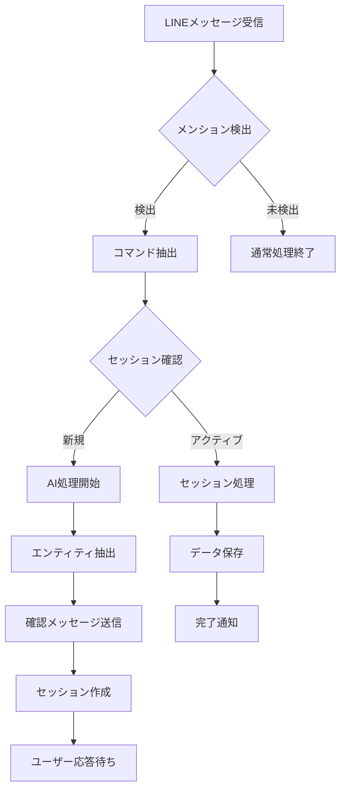

# 統合機能仕様書

## 1. 統合システム概要

### 1.1 統合アーキテクチャ
Find To Do Management Appは、5つの主要フェーズによる段階的統合システムとして設計されています。各フェーズは独立性を保ちながら、密接に連携してエンタープライズレベルの機能を提供します。

### 1.2 Phase別統合構成

```
Phase 1: 学生リソース管理・MBTI分析
Phase 2: 財務管理・LTV分析  
Phase 3: Google連携・ドキュメント自動化
Phase 4: 営業自動化・AI予測
Phase 5: リアルタイム監視・運用最適化
```

### 1.3 統合監視システム
**SystemIntegrator**コンポーネントにより、全フェーズの統合状況をリアルタイム監視し、システム全体の健全性を保証します。

## 2. LINE Bot統合

### 2.1 LINE Bot統合アーキテクチャ

```
LINE Platform → Webhook → Message Processor → AI Engine → Data Saver → Dashboard
```

### 2.2 主要コンポーネント

#### MessageProcessor
**場所**: `src/lib/line/message-processor.ts`
**機能**:
- メンション検出（公式・フォールバック）
- コマンド抽出・分類
- セッション状態管理
- AI処理トリガー

```typescript
interface MessageProcessingFlow {
  1: "メッセージ受信・解析"
  2: "メンション・コマンド検出" 
  3: "セッション状態確認"
  4: "AI処理またはコマンド実行"
  5: "レスポンス生成・送信"
}
```

#### TextProcessor (AI Engine)
**場所**: `src/lib/line/text-processor.ts`  
**機能**:
- Gemini APIによる自然言語処理
- 7種エンティティの自動抽出
- 信頼度スコア計算
- フォールバック処理

**対応エンティティ**:
```typescript
type SupportedEntities = 
  | 'personal_schedule'    // 個人予定
  | 'schedule'            // イベント・会議
  | 'task'                // タスク・TODO
  | 'project'             // プロジェクト
  | 'contact'             // 人脈・コネクション
  | 'appointment'         // アポイントメント
  | 'memo'                // メモ・ナレッジ
```

#### SessionManager
**場所**: `src/lib/line/session-manager.ts`
**機能**:
- インメモリセッション管理
- タイムアウト処理（メニュー: 2分、詳細入力: 30分）
- データ継承・状態追跡
- 保存状態管理

#### DataSaver
**場所**: `src/lib/line/data-saver.ts`
**機能**:
- 7種エンティティの統一的データ保存
- 日時パース・バリデーション
- 担当者・作成者管理
- 関連データ自動生成（アポイント→カレンダーイベント）

### 2.3 LINE統合フロー

#### メッセージ処理フロー


### 2.4 統合効果
- **自然言語インターフェース**: 技術的な操作不要
- **リアルタイム連携**: LINE→ダッシュボード即時反映
- **包括的データ作成**: 7種類のエンティティ対応
- **AI品質保証**: 高精度な意図理解と抽出

## 3. AI・機械学習統合

### 3.1 AI統合システム概要

Find To Do Management Appは、複数のAIエンジンを統合し、予測・分析・自動化機能を提供します。

### 3.2 主要AIサービス

#### AIEvaluationEngine
**場所**: `src/lib/ai/evaluation-engine.ts`
**機能**:
- タスク・プロジェクトの成功度評価
- リソースウェイト自動計算
- 課題レベル判定
- 信頼度スコア提供

**評価タイプ**:
```typescript
type EvaluationType = 
  | 'resource_weight'      // リソース重要度
  | 'success_probability'  // 成功確率
  | 'issue_level'         // 課題レベル
```

#### SalesConversionPredictor
**場所**: `src/lib/ai/sales-prediction.ts`
**機能**:
- 営業成約確率予測
- 顧客価値分析
- 最適化提案生成
- 営業メトリクス計算

#### TaskKnowledgeAutomator
**場所**: `src/lib/ai/knowledge-automator.ts`
**機能**:
- タスク完了時の自動ナレッジ化判定
- 価値評価・優先度計算
- 自動ナレッジ生成
- 品質スコア管理

### 3.3 統合AI処理フロー

```typescript
// AI統合処理例
async function processAIEvaluation(entityType: string, entityId: string) {
  // 1. データ取得
  const entity = await getEntity(entityType, entityId);
  
  // 2. AI評価実行
  const evaluation = await AIEvaluationEngine.evaluate(entity);
  
  // 3. 結果保存
  await saveEvaluation(entityId, evaluation);
  
  // 4. 関連システム更新
  await updateRelatedSystems(entityType, entityId, evaluation);
  
  // 5. 通知・アラート
  if (evaluation.requiresAlert) {
    await sendAlert(evaluation);
  }
}
```

## 4. Google Services統合

### 4.1 Google連携概要

複数のGoogle Servicesと統合し、包括的な分析・自動化機能を提供します。

### 4.2 Google Analytics 4統合

#### GA4ReportsService
**場所**: `src/lib/google/ga4-reports.ts`
**機能**:
- リアルタイムユーザー数取得
- セッション・ページビュー分析
- コンバージョン率計測
- 期間別レポート生成

**取得メトリクス**:
```typescript
interface GA4Metrics {
  sessions: number;
  users: number;
  pageviews: number;
  conversionRate: number;
  averageSessionDuration: number;
  bounceRate: number;
  topPages: Array<{
    page: string;
    views: number;
  }>;
}
```

### 4.3 Search Console統合

#### SearchConsoleService
**場所**: `src/lib/google/search-console.ts`
**機能**:
- 検索パフォーマンス分析
- クエリ・インプレッション数取得
- CTR・平均掲載順位分析
- SEOインサイト生成

### 4.4 Google Apps Script統合

#### GAS Webhook処理
**エンドポイント**: `/api/webhook/google-docs-gas`
**機能**:
- Google Docsの自動同期
- AI分析による自動ナレッジ化
- 推奨アクション生成
- 統合ダッシュボード連携

**処理フロー**:
```typescript
// GAS連携処理
async function handleGASWebhook(payload: GASWebhookPayload) {
  // 1. ドキュメント同期
  const docData = await syncGoogleDoc(payload.documentId);
  
  // 2. AI分析実行
  const analysis = await analyzeContent(docData.content);
  
  // 3. ナレッジ自動生成
  if (analysis.shouldGenerateKnowledge) {
    await generateKnowledge(analysis);
  }
  
  // 4. 推奨アクション作成
  await createRecommendations(analysis);
}
```

## 5. リアルタイム統合

### 5.1 WebSocket統合システム

#### RealTimeManager
**場所**: `src/lib/realtime/manager.ts`
**機能**:
- WebSocket接続管理
- イベント配信・購読
- 接続状態監視
- フォールバック処理

#### 配信イベント
```typescript
type RealtimeEventType =
  | 'metrics_update'      // メトリクス更新
  | 'entity_update'       // エンティティ変更
  | 'system_alert'        // システムアラート
  | 'user_activity'       // ユーザー活動
  | 'ai_analysis_complete' // AI分析完了
```

### 5.2 リアルタイムダッシュボード

#### 機能
- ライブメトリクス表示
- リアルタイムイベントフィード
- システムヘルス監視
- アクティブユーザー追跡

#### 実装例
```typescript
// リアルタイム更新フック
export const useRealtimeMetrics = () => {
  const [metrics, setMetrics] = useState<RealtimeMetrics>();
  const { socket, isConnected } = useWebSocket();

  useEffect(() => {
    if (!socket) return;

    socket.on('metrics_update', (data: RealtimeMetrics) => {
      setMetrics(data);
    });

    return () => {
      socket.off('metrics_update');
    };
  }, [socket]);

  return { metrics, isConnected };
};
```

## 6. データ統合・ETL

### 6.1 統合ダッシュボードAPI

#### `/api/dashboard/integrated`
**機能**: 全システムの統合状況をリアルタイム分析

**統合データソース**:
```typescript
interface IntegratedDashboardData {
  // Phase 1: 学生リソース管理
  resourceManagement: {
    students: StudentResource[];
    allocations: ProjectResourceAllocation[];
    mbtiAnalyses: MBTITeamAnalysis[];
  };
  
  // Phase 2: 財務・LTV分析
  financialManagement: {
    projectFinancials: ProjectFinancialDetails[];
    ltvAnalyses: CustomerLTVAnalysis[];
    templates: ProjectTemplate[];
  };
  
  // Phase 3: Google連携
  googleIntegration: {
    ga4Metrics: GA4Metrics;
    searchConsoleData: SearchConsoleMetrics;
    documentsSync: GoogleDocsSource[];
  };
  
  // Phase 4: 営業自動化
  salesAutomation: {
    opportunities: SalesOpportunity[];
    predictions: ConversionPrediction[];
    activities: SalesActivity[];
  };
  
  // Phase 5: リアルタイム監視
  realtimeMonitoring: {
    systemHealth: SystemHealthMetrics;
    activeUsers: number;
    liveEvents: RealtimeEvent[];
  };
}
```

### 6.2 統合カレンダーAPI

#### `/api/calendar/unified`
**機能**: 複数データソースの統合カレンダー表示

**統合ソース**:
```typescript
// 4つのデータソースを統合
const unifiedSources = [
  'personal_schedules',    // 個人予定
  'calendar_events',       // 公開イベント  
  'tasks',                // タスク期限
  'appointments'           // アポイントメント
];
```

**データ変換・統合処理**:
```typescript
async function getUnifiedCalendarEvents(params: CalendarParams) {
  // 並列データ取得
  const [personalSchedules, calendarEvents, tasks, appointments] = 
    await Promise.all([
      getPersonalSchedules(params),
      getCalendarEvents(params), 
      getTaskDeadlines(params),
      getAppointmentEvents(params)
    ]);

  // 統一形式に変換
  const unifiedEvents = [
    ...personalSchedules.map(transformToUnifiedEvent),
    ...calendarEvents.map(transformToUnifiedEvent),
    ...tasks.map(transformTaskToEvent),
    ...appointments.map(transformAppointmentToEvent)
  ];

  // 重複除去・ソート
  return deduplicateAndSort(unifiedEvents);
}
```

## 7. エラーハンドリング・復旧

### 7.1 統合システムエラー処理

#### 自動復旧機能
```typescript
class IntegrationErrorHandler {
  async handleServiceFailure(service: string, error: Error) {
    // 1. エラーログ記録
    await logError(service, error);
    
    // 2. フォールバック処理
    const fallbackResult = await executeFallback(service);
    
    // 3. 管理者通知
    if (isCriticalError(error)) {
      await notifyAdministrators(service, error);
    }
    
    // 4. 自動復旧試行
    setTimeout(() => this.attemptRecovery(service), 30000);
    
    return fallbackResult;
  }

  async attemptRecovery(service: string) {
    try {
      await reinitializeService(service);
      await logRecovery(service);
    } catch (recoveryError) {
      await this.handleServiceFailure(service, recoveryError);
    }
  }
}
```

### 7.2 データ整合性保証

#### 整合性チェック機能
```typescript
class DataIntegrityChecker {
  async performIntegrityCheck() {
    const checks = [
      this.checkTaskProjectRelationships(),
      this.checkCalendarEventReferences(),
      this.checkUserAssignments(),
      this.checkFinancialDataConsistency()
    ];

    const results = await Promise.allSettled(checks);
    
    const issues = results
      .filter(result => result.status === 'rejected')
      .map(result => result.reason);

    if (issues.length > 0) {
      await this.reportIntegrityIssues(issues);
      await this.attemptAutoFix(issues);
    }
  }
}
```

## 8. パフォーマンス最適化

### 8.1 統合処理最適化

#### 並列処理
```typescript
// 複数API並列実行
async function fetchDashboardData() {
  const [tasks, projects, appointments, analytics] = await Promise.all([
    fetch('/api/tasks'),
    fetch('/api/projects'), 
    fetch('/api/appointments'),
    fetch('/api/analytics/dashboard')
  ]);

  return {
    tasks: await tasks.json(),
    projects: await projects.json(),
    appointments: await appointments.json(),
    analytics: await analytics.json()
  };
}
```

#### キャッシュ戦略
```typescript
// 5分間キャッシュ
const CACHE_DURATION = 5 * 60 * 1000;

class IntegratedDataCache {
  private cache = new Map<string, CacheEntry>();

  async get<T>(key: string, fetcher: () => Promise<T>): Promise<T> {
    const cached = this.cache.get(key);
    
    if (cached && Date.now() - cached.timestamp < CACHE_DURATION) {
      return cached.data as T;
    }

    const data = await fetcher();
    this.cache.set(key, {
      data,
      timestamp: Date.now()
    });

    return data;
  }
}
```

## 9. セキュリティ統合

### 9.1 認証・認可統合

#### 統一権限管理
```typescript
// ロールベースアクセス制御
const PERMISSIONS = {
  'dashboard.view': ['MEMBER', 'MANAGER', 'ADMIN'],
  'projects.manage': ['MANAGER', 'ADMIN'],
  'admin.system': ['ADMIN'],
  'analytics.advanced': ['MANAGER', 'ADMIN']
};

async function checkPermission(user: User, permission: string): Promise<boolean> {
  const allowedRoles = PERMISSIONS[permission];
  return allowedRoles?.includes(user.role) || false;
}
```

### 9.2 API セキュリティ

#### 署名検証（LINE Webhook）
```typescript
function verifyLineSignature(body: string, signature: string): boolean {
  const hash = crypto
    .createHmac('SHA256', process.env.LINE_CHANNEL_SECRET!)
    .update(body)
    .digest('base64');
  
  return crypto.timingSafeEqual(
    Buffer.from(signature),
    Buffer.from(hash)
  );
}
```

## 10. 監視・運用統合

### 10.1 統合監視システム

#### SystemIntegrator
**機能**:
- 全フェーズの統合状況監視
- システムヘルス計算
- 異常検知・アラート
- パフォーマンス分析

```typescript
interface SystemHealthCheck {
  phase1: PhaseHealthMetrics;  // 学生リソース管理
  phase2: PhaseHealthMetrics;  // 財務・LTV分析
  phase3: PhaseHealthMetrics;  // Google連携
  phase4: PhaseHealthMetrics;  // 営業自動化
  phase5: PhaseHealthMetrics;  // リアルタイム監視
  overall: number;             // 総合ヘルススコア
}
```

### 10.2 運用自動化

#### 自動メンテナンス
```typescript
class AutoMaintenanceSystem {
  async performScheduledMaintenance() {
    // 1. データベース最適化
    await optimizeDatabase();
    
    // 2. 古いログクリーンアップ
    await cleanupOldLogs();
    
    // 3. キャッシュ更新
    await refreshSystemCaches();
    
    // 4. ヘルスチェック実行
    const healthStatus = await performSystemHealthCheck();
    
    // 5. レポート生成
    await generateMaintenanceReport(healthStatus);
  }
}
```

---

*この統合機能仕様書は、実装されている統合システムの現状に基づいて作成されており、システムの発展に伴い継続的に更新されます。*