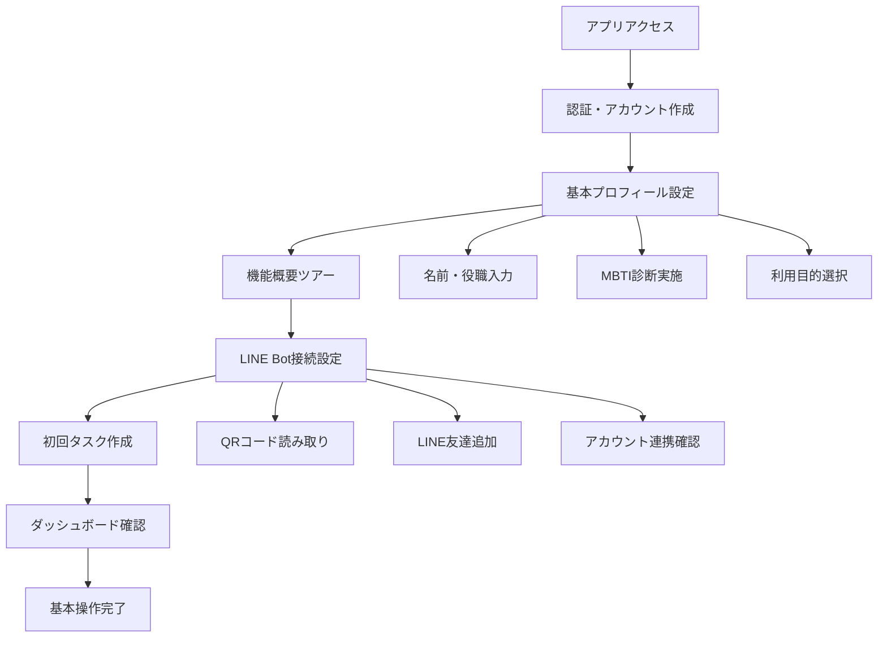
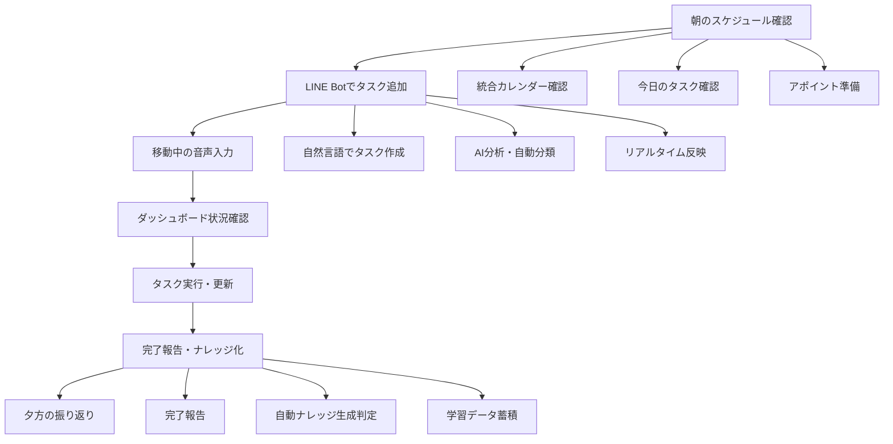
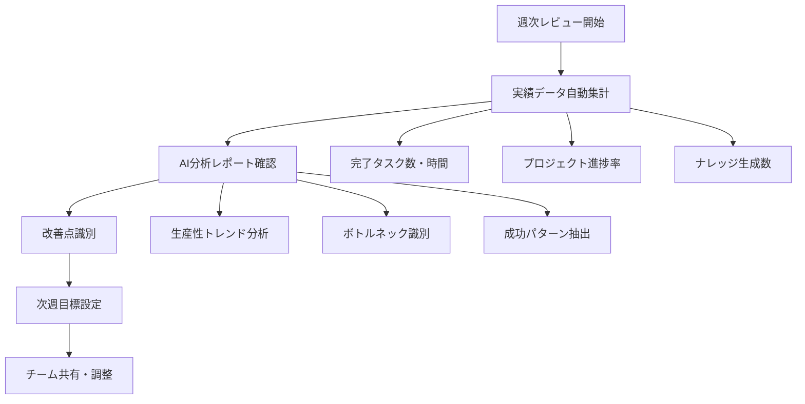
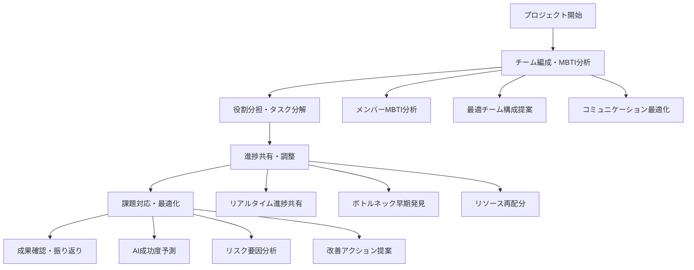
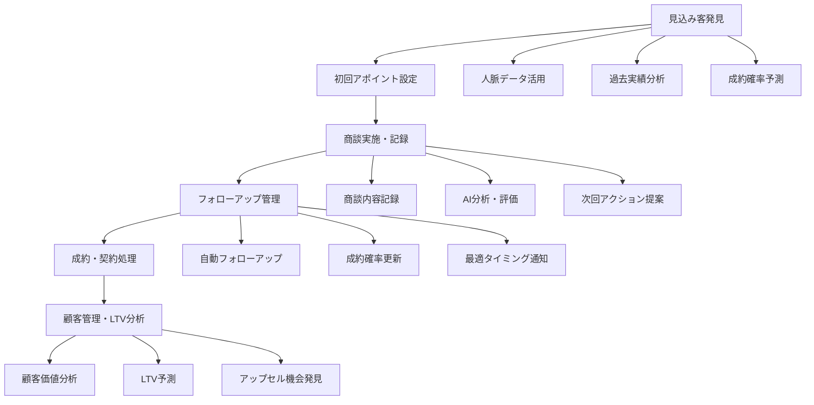
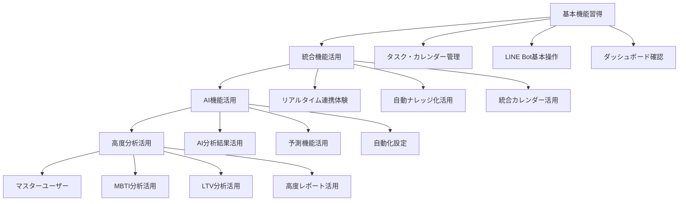
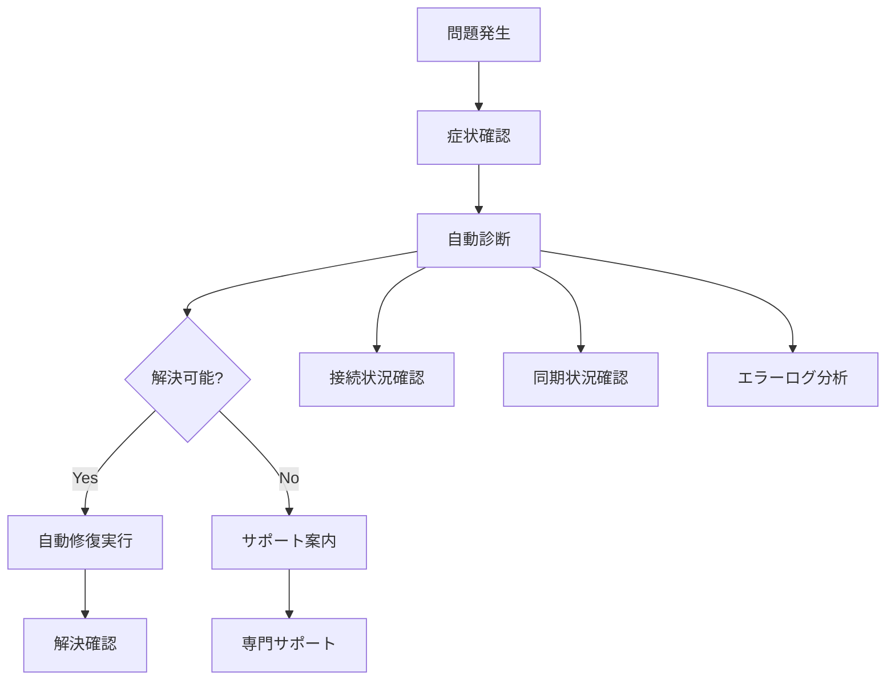

# Find To Do Management App - 基本ユーザーフロー

## 1. 初回セットアップフロー

### 1.1 アプリ導入から基本利用開始まで

**ステップ詳細:**

1. **認証・アカウント作成 (2分)**
   - OAuth認証またはメール登録
   - 基本情報入力

2. **基本プロフィール設定 (5分)**
   - 名前、役職、所属組織
   - **MBTI診断実施** - チーム最適化の基盤データ
   - 利用目的選択（個人/チーム/営業/経営）

3. **機能概要ツアー (3分)**
   - ダッシュボード、カンバンボード、カレンダー
   - 統合機能（LINE Bot、AI分析）の説明

4. **LINE Bot接続 (2分)**
   - QRコード読み取り
   - 友達追加→アカウント連携
   - テスト送信で動作確認

5. **初回タスク作成 (5分)**
   - LINE Botでの自然言語タスク作成体験
   - ダッシュボードでのリアルタイム反映確認

**成功指標:** LINE Botから初回タスクを作成し、ダッシュボードで確認完了

## 2. 日常利用フロー

### 2.1 典型的な1日の利用パターン

**主要な利用シーン:**

1. **朝のプランニング (5分)**
   - 統合カレンダーで今日の予定確認
   - タスク優先度をAI分析結果で判断
   - LINE Botで急遽発生したタスク追加

2. **移動中・外出先 (随時)**
   - LINE Botでの自然言語入力
   - 音声メッセージでのタスク作成
   - リアルタイム同期でチーム情報共有

3. **デスク作業時 (日中)**
   - ダッシュボードでの進捗確認
   - カンバンボードでの状態管理
   - AI分析結果による優先度調整

4. **完了時の価値創出 (各タスク完了時)**
   - タスク完了報告
   - 自動ナレッジ化判定・生成
   - 次のアクション提案受け取り

### 2.2 週次・月次レビューフロー

## 3. チーム利用フロー

### 3.1 チームプロジェクト管理フロー

**チーム活用のメリット:**

1. **MBTI分析による最適化**
   - 個性を活かした役割分担
   - コミュニケーションスタイル調整
   - チーム力最大化

2. **リアルタイム連携**
   - LINE Botでの即座な情報共有
   - 進捗可視化・課題早期発見
   - 自動アラート・通知機能

3. **AI支援による継続改善**
   - 成功パターン学習・適用
   - リスク予測・予防措置
   - 最適化提案の自動生成

## 4. 営業活動フロー

### 4.1 営業プロセス管理フロー

**営業活動での統合効果:**

1. **AI予測による効率化**
   - 成約確率の自動計算
   - 最適なアプローチタイミング提案
   - 成功パターンの学習・適用

2. **包括的顧客管理**
   - 全接点の一元管理
   - LTV分析による価値評価
   - 長期関係構築支援

3. **自動化による生産性向上**
   - フォローアップの自動化
   - 商談記録の効率化
   - レポート自動生成

## 5. 機能習得フロー

### 5.1 段階的機能習得パス

**習得レベル別推奨期間:**

- **レベル1 (基本機能):** 1週間
  - 基本的なタスク・スケジュール管理
  - LINE Botでの簡単な操作

- **レベル2 (統合機能):** 2週間
  - リアルタイム連携の実感
  - 自動化機能の体験

- **レベル3 (AI機能):** 1ヶ月
  - AI分析結果の理解・活用
  - 予測機能による改善実感

- **レベル4 (高度分析):** 2-3ヶ月
  - MBTI・LTV分析の戦略的活用
  - 包括的な業務最適化実現

## 6. トラブルシューティング・サポートフロー

### 6.1 問題解決フロー

**よくある問題と解決方法:**

1. **LINE Bot応答なし**
   - LINE友達追加状況確認
   - アカウント連携再実行
   - メンション方法確認

2. **データ同期されない**
   - ネットワーク接続確認
   - 手動同期実行
   - ブラウザ再読み込み

3. **AI分析結果が出ない**
   - データ量確認（最低限のデータ必要）
   - 分析対象期間調整
   - 分析設定確認

---

このフローにより、新規ユーザーから上級ユーザーまで、システムの価値を段階的に体験し、最終的には高度な統合機能を活用した業務最適化を実現できます。