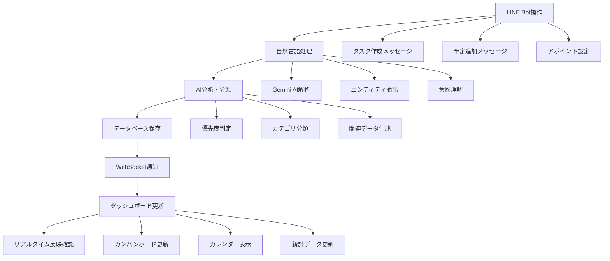
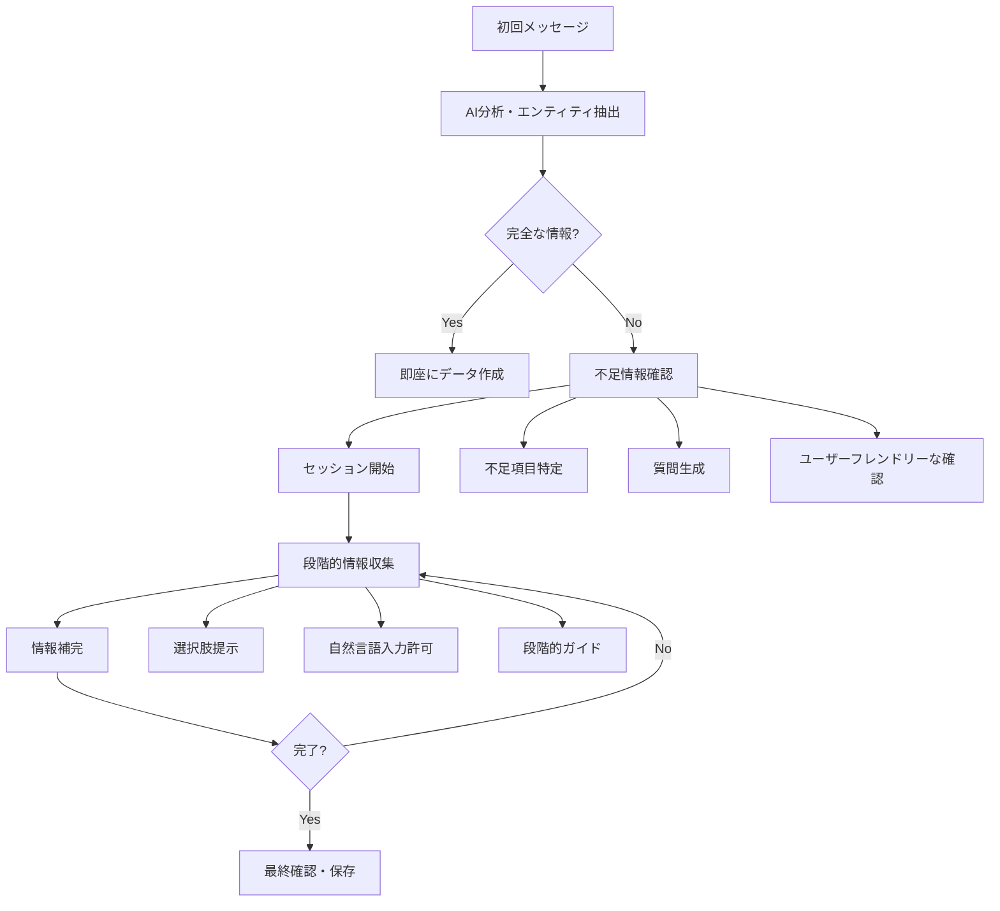
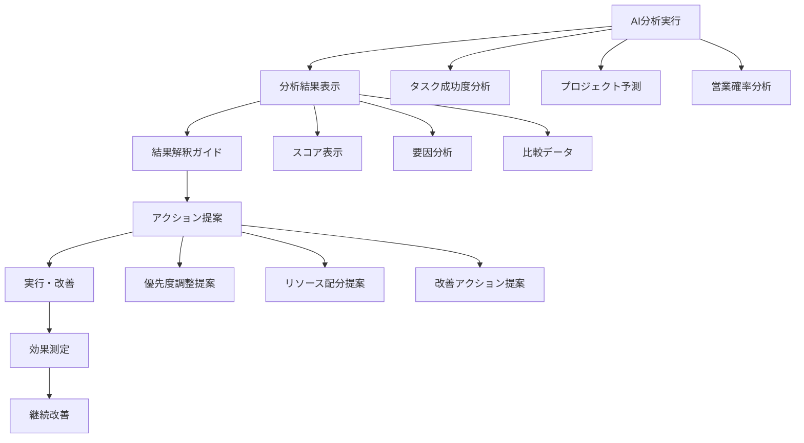
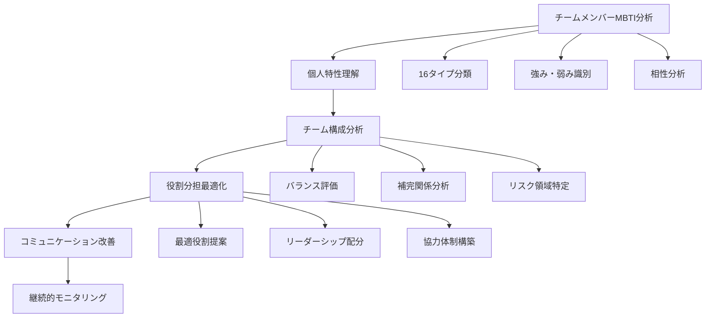
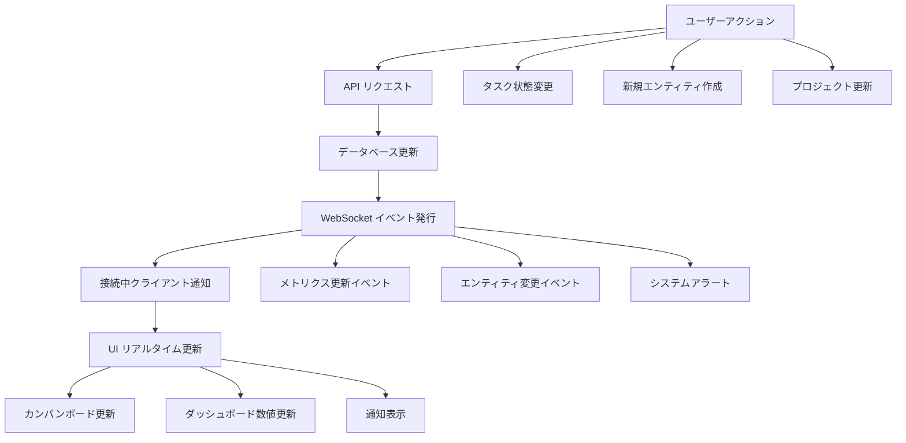
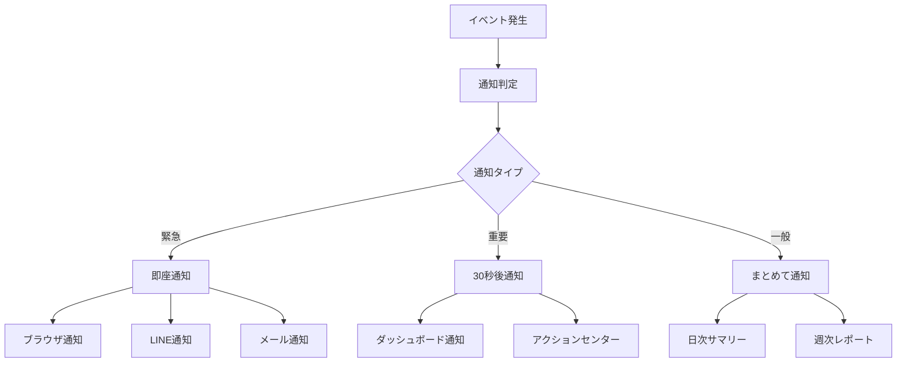
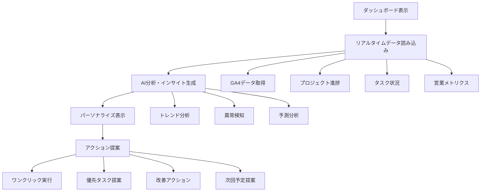
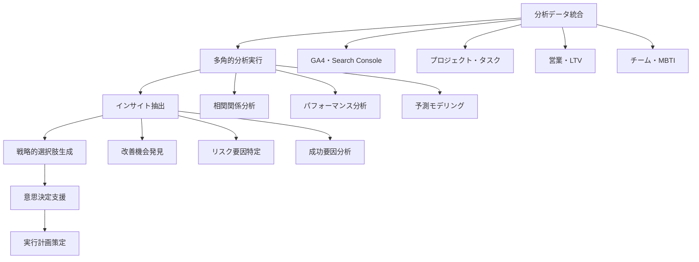

# Find To Do Management App - 統合活用フロー

## 1. LINE Bot + ダッシュボード統合活用フロー

### 1.1 リアルタイム連携体験フロー



**具体的な統合体験シナリオ:**

#### シナリオ1: 外出中のタスク追加
1. **LINE Bot入力**
   ```
   ユーザー: 「@find-todo 明日の午後にクライアントAとの契約書レビューを30分でお願いします」
   ```

2. **AI処理・分析**
   - 自然言語解析で以下を抽出:
     - タスク名: "クライアントAとの契約書レビュー"
     - 期限: 明日の午後
     - 予想時間: 30分
     - 優先度: 高（契約関連）

3. **リアルタイム反映**
   - ダッシュボードのカンバンボードに即座に表示
   - カレンダーに時間ブロック自動作成
   - 関連プロジェクトがあれば自動紐付け

4. **フィードバック・確認**
   ```
   Bot: 「契約書レビューのタスクを作成しました📋
   
   ✅ タスク: クライアントAとの契約書レビュー
   📅 期限: 明日の午後
   ⏰ 予想時間: 30分
   🔥 優先度: 高
   
   ダッシュボードでご確認ください！」
   ```

#### シナリオ2: 複雑な予定の一括設定
1. **LINE Bot入力**
   ```
   ユーザー: 「@find-todo 来週の火曜日から金曜日まで毎日15時に田中さんとの進捗確認MTGを30分ずつお願いします」
   ```

2. **AI処理・分析**
   - 繰り返し予定として認識
   - 参加者: 田中さん（人脈データと照合）
   - 期間: 4日間連続
   - 時間: 各日15:00-15:30

3. **統合処理**
   - 4つの予定を一括作成
   - 田中さんのスケジュールと照合（競合チェック）
   - プロジェクト関連性の自動判定

4. **確認・調整**
   ```
   Bot: 「田中さんとの進捗確認MTGを4日分設定しました📅
   
   📋 詳細:
   • 火曜日 15:00-15:30 ✅
   • 水曜日 15:00-15:30 ✅
   • 木曜日 15:00-15:30 ⚠️ 田中さんの他予定と重複
   • 金曜日 15:00-15:30 ✅
   
   水曜日の調整が必要です。代替時間を提案しますか？」
   ```

### 1.2 セッション管理による段階的入力フロー



**段階的入力の実例:**

#### プロジェクト作成の段階的入力
1. **初回入力**
   ```
   ユーザー: 「@find-todo 新しいプロジェクトを作成したいです」
   ```

2. **AI分析・不足情報確認**
   ```
   Bot: 「新しいプロジェクトを作成しますね！📊
   
   まず、プロジェクトの基本情報を教えてください：
   
   📝 プロジェクト名: ?
   📅 期限: ?
   👥 チームメンバー: ?
   🎯 目標・成果物: ?
   
   1つずつ確認していきましょう。
   まず、プロジェクト名を教えてください。」
   ```

3. **段階的情報収集**
   ```
   ユーザー: 「ECサイトリニューアル」
   
   Bot: 「『ECサイトリニューアル』ですね！✨
   
   次に、プロジェクトの期限はいつ頃を予定していますか？
   
   例: 
   • 3ヶ月後
   • 2024年12月末
   • 来年の春まで」
   ```

4. **情報補完・最終確認**
   ```
   Bot: 「プロジェクト情報を確認させてください📋
   
   📊 プロジェクト名: ECサイトリニューアル
   📅 期限: 2024年12月末
   👥 チームメンバー: 田中さん、佐藤さん、自分
   🎯 目標: 売上20%向上、UX改善
   
   この内容で作成しますか？
   
   [✅ 作成する] [✏️ 修正する] [❌ キャンセル]」
   ```

## 2. AI分析結果の活用フロー

### 2.1 AI分析レポートの読み方・活用方法



**AI分析結果の活用例:**

#### 1. タスク成功度分析の活用
**分析結果例:**
```
📊 タスク成功度分析レポート

🎯 対象タスク: "新機能の設計書作成"
📈 予測成功度: 78%
⏰ 予想完了時間: 6.5時間
🔥 優先度: 高

📋 要因分析:
✅ 強み:
• 過去の設計書作成経験が豊富
• 関連知識が十分
• チームサポートが期待できる

⚠️ リスク要因:
• 要件が曖昧（-15%）
• 複数タスクとの競合（-7%）
```

**活用アクション:**
1. **要件明確化**: 関係者との事前打ち合わせ設定
2. **スケジュール調整**: 他タスクとの優先度調整
3. **リソース確保**: 集中できる時間ブロック確保

#### 2. プロジェクト予測の活用
**分析結果例:**
```
📊 プロジェクト成功予測レポート

🎯 プロジェクト: "ECサイトリニューアル"
📈 成功確率: 82%
📅 予想完了: 2024年11月中旬（当初予定より2週間早い）
💰 予算達成率: 95%

🔍 詳細分析:
👥 チーム力: 88% (MBTIバランス良好)
📋 計画性: 79% (一部タスクで詳細化必要)
🔧 技術力: 91% (十分な経験・スキル)
```

**活用アクション:**
1. **早期完了の可能性**: リソース再配分で他プロジェクト加速
2. **計画性向上**: 詳細化が必要なタスクの洗い出し
3. **チーム強化**: 既存の良好なバランスを維持

### 2.2 MBTI分析によるチーム最適化フロー



**MBTI分析活用の実例:**

#### チーム構成分析例
```
👥 チームMBTI分析レポート

📊 チーム構成:
• 田中さん (ENTJ) - 戦略的リーダー
• 佐藤さん (ISFJ) - 調整・サポート
• 山田さん (ENTP) - アイデア・革新
• 自分 (ISTJ) - 実行・品質管理

🎯 チーム強み:
✅ 戦略性 (ENTJ) + 実行力 (ISTJ) = 確実な成果
✅ 革新性 (ENTP) + 調整力 (ISFJ) = バランス良いアイデア実現
✅ 4つの機能が相互補完

⚠️ 注意点:
• ENTJとENTPで方向性の対立可能性
• ISFJのストレス管理が重要
• 意思決定プロセスの明確化が必要

💡 最適化提案:
1. 田中さん: プロジェクトリーダー・戦略策定
2. 佐藤さん: チーム調整・品質チェック
3. 山田さん: アイデア創出・課題解決
4. 自分: 実行管理・進捗管理
```

#### コミュニケーション最適化
```
💬 コミュニケーション最適化ガイド

🎯 個別対応方法:
• 田中さん (ENTJ): 結論先行、効率重視で報告
• 佐藤さん (ISFJ): 丁寧な説明、感謝の気持ちを表現
• 山田さん (ENTP): 新しいアイデアに対する建設的議論
• 自分 (ISTJ): 具体的な計画、段階的な確認

📅 会議スタイル:
• 戦略議論: 田中さん主導、山田さんがアイデア提供
• 進捗報告: 自分が詳細報告、佐藤さんが問題点フォロー
• 課題解決: 全員でブレスト、田中さんが最終判断
```

## 3. リアルタイム更新の体験設計

### 3.1 WebSocketによるリアルタイム連携フロー



**リアルタイム更新の体験例:**

#### 1. チーム作業での即座な連携
**シナリオ:** 複数メンバーが同じプロジェクトで作業中

1. **メンバーA**: タスクを「進行中」に変更
   - カンバンボードでドラッグ&ドロップ
   - 瞬時にデータベース更新

2. **メンバーB**: リアルタイムで変更を確認
   - 自動的にボードが更新
   - 「メンバーAが○○を進行中に変更しました」通知

3. **チーム全体**: 進捗状況を即座に把握
   - プロジェクト進捗率が自動更新
   - 関連する他のタスクの優先度も自動調整

#### 2. LINE Bot→ダッシュボード即時反映
**体験フロー:**
```
1. [LINE Bot] ユーザーがタスク作成
   ↓ 2秒以内
2. [ダッシュボード] 新しいタスクが表示
   ↓ 同時
3. [統計] 今日のタスク数が+1
   ↓ 同時
4. [AI分析] 優先度が自動計算・表示
```

### 3.2 リアルタイム通知・アラートシステム



**通知の種類と体験:**

#### 1. 緊急通知（即座）
- **重要な期限切れ**: 「契約書レビューの期限が過ぎています」
- **システム障害**: 「LINE Bot連携に問題が発生しました」
- **重要なアポイント**: 「30分後にクライアントとの商談があります」

#### 2. 重要通知（30秒後）
- **AI分析完了**: 「プロジェクト成功度分析が完了しました」
- **チーム更新**: 「田中さんがタスクを完了しました」
- **目標達成**: 「今月の売上目標を達成しました」

#### 3. 一般通知（まとめて）
- **日次サマリー**: 「今日の成果：タスク5件完了、新規ナレッジ2件」
- **週次レポート**: 「今週の成果と来週の重要タスク」

## 4. 統合ダッシュボードの活用フロー

### 4.1 スマートダッシュボード活用フロー



**ダッシュボード活用シナリオ:**

#### 朝の状況把握（5分間ルーチン）
1. **一目で全体状況を把握**
   ```
   📊 今日の状況
   ✅ 完了予定タスク: 3件
   📅 今日のアポイント: 2件
   🔥 緊急度高いタスク: 1件
   📈 今週の進捗: 78%
   ```

2. **AI分析インサイトの確認**
   ```
   🤖 AI分析結果
   ⚠️ 注意: 契約書レビューの期限が今日です
   💡 提案: 午前中に集中してクライアント対応を完了
   📈 予測: 今日の成果でプロジェクト進捗が85%に到達
   ```

3. **優先アクションの確認**
   ```
   🎯 今日の優先アクション
   1. 契約書レビュー (期限今日・重要度高)
   2. 田中さんとの進捗確認 (15:00)
   3. 来週の企画資料準備 (余裕があれば)
   ```

#### 週次レビュー（15分間ルーチン）
1. **週間成果の確認**
   - 完了タスク数・時間の分析
   - プロジェクト進捗率の確認
   - 生成されたナレッジの確認

2. **AI分析による改善点の把握**
   - 生産性のトレンド分析
   - ボトルネックの識別
   - 成功パターンの抽出

3. **来週の計画立案**
   - AI提案による最適スケジュール
   - 優先度の自動調整
   - チーム連携の最適化

### 4.2 統合分析による戦略的意思決定フロー



**戦略的意思決定の例:**

#### 新規事業の意思決定プロセス
1. **統合データ分析**
   - 既存プロジェクトの成功要因分析
   - チームの強み・弱み分析（MBTI）
   - 市場データ・競合分析（GA4/Search Console）
   - 顧客価値分析（LTV）

2. **AI分析による予測**
   ```
   🤖 新規事業分析レポート
   
   📈 成功確率: 73%
   💰 予想ROI: 15-20%
   ⏰ 予想期間: 8-10ヶ月
   
   🎯 成功要因:
   • チームの技術力が高い
   • 既存顧客からの高い評価
   • 市場ニーズとのマッチ度高
   
   ⚠️ リスク要因:
   • 新規技術の学習コスト
   • 競合の参入可能性
   • リソース配分の調整必要
   ```

3. **選択肢の提示**
   ```
   💡 推奨アクション
   
   選択肢A: 積極的推進
   • 成功確率: 73%
   • 必要リソース: 3名×6ヶ月
   • 期待利益: 年間2,000万円
   
   選択肢B: 段階的推進
   • 成功確率: 85%
   • 必要リソース: 2名×3ヶ月（検証期間）
   • 期待利益: 年間1,200万円
   
   選択肢C: 見送り
   • 既存事業に集中
   • リソース確保困難
   • 他の機会を検討
   ```

4. **実行計画の策定**
   - 選択された戦略に基づく詳細計画
   - タスク・マイルストーンの自動生成
   - チーム配置・役割分担の最適化
   - 進捗監視・評価指標の設定

---

このように、統合機能を活用することで、単なるタスク管理を超越した戦略的な業務最適化とデータドリブンな意思決定を実現できます。