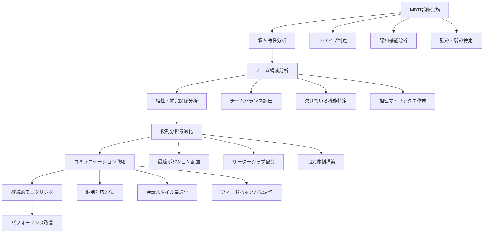
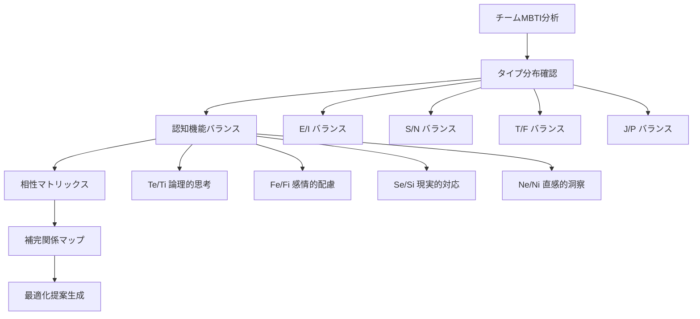
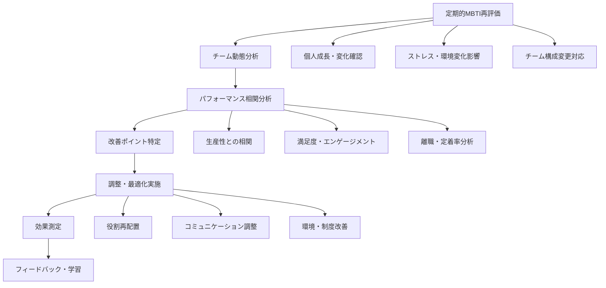
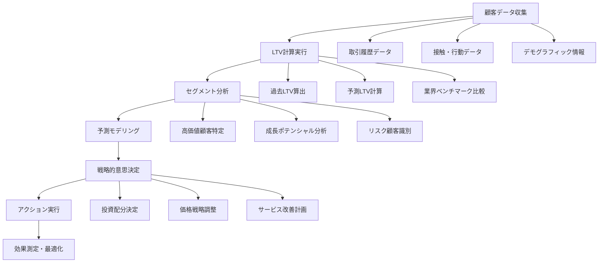
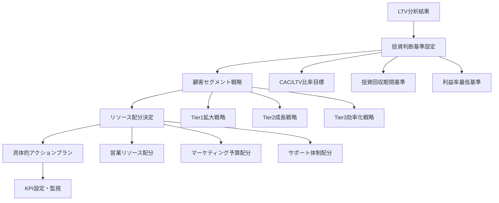
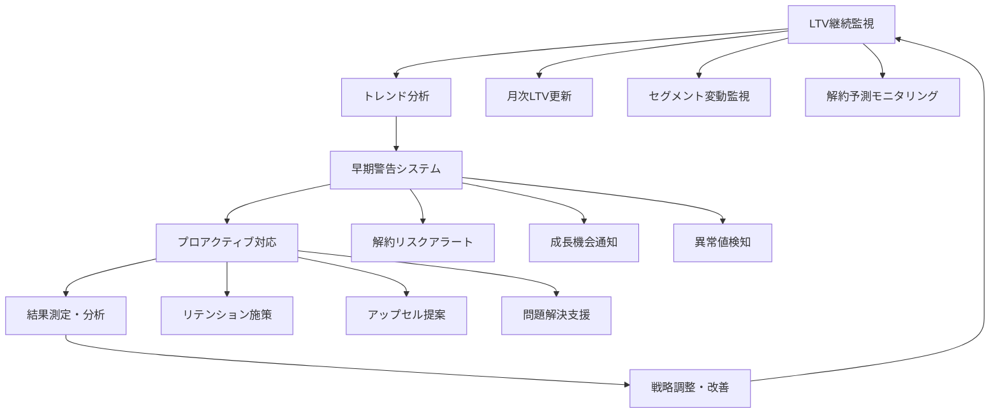
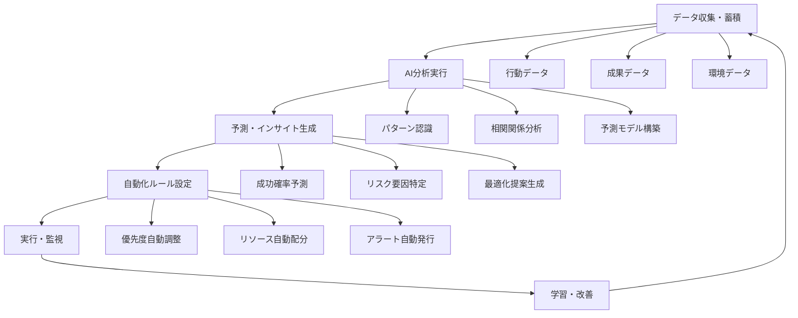
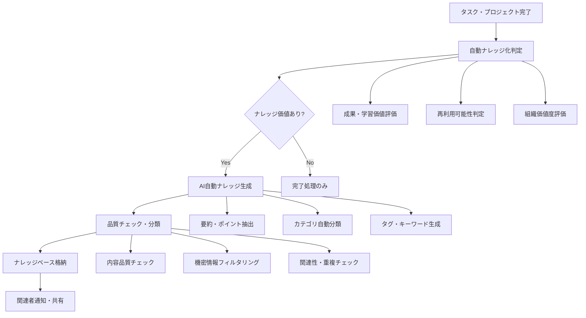

# Find To Do Management App - 高度活用フロー

## 1. MBTI分析によるチーム最適化フロー

### 1.1 個人MBTI分析からチーム最適化まで



### 1.2 MBTI活用の具体的実践フロー

#### Phase 1: 個人分析・理解（1-2週間）

**ステップ1: MBTI診断実施**
```
🧠 MBTI診断プロセス

1. 初回診断（15分）
   - 性格傾向質問 (80問)
   - 行動パターン分析
   - 価値観・動機の確認

2. 結果分析
   - 16タイプ分類
   - 認知機能の順序
   - 強み・弱みの詳細分析

3. パーソナルレポート生成
   - 仕事スタイル
   - ストレス要因
   - 成長のポイント
```

**個人分析結果例:**
```
👤 MBTI分析レポート - 田中太郎さん

🎯 タイプ: ENTJ (指揮官型)
🔄 認知機能:
1. Te (外向的思考) - 主機能
2. Ni (内向的直観) - 補助機能
3. Se (外向的感覚) - 第三機能
4. Fi (内向的感情) - 劣等機能

💪 仕事での強み:
• 戦略的思考・長期計画立案
• チームの方向性を明確化
• 効率性追求・システム化
• 困難な決断を迅速に実行

⚠️ 注意が必要な点:
• 細かい感情配慮が苦手
• 完璧主義でストレス増大
• 異なる意見への耐性が低い
• 急な変更への対応困難

🎯 最適な役割:
• プロジェクトリーダー
• 戦略策定責任者
• チーム統括・意思決定者
```

#### Phase 2: チーム構成分析（2-3週間）

**ステップ2: チームMBTI構成の可視化**



**チーム構成分析例:**
```
👥 プロジェクトチーム MBTI分析

📊 チーム構成 (5名):
• 田中さん (ENTJ) - プロジェクトリーダー
• 佐藤さん (ISFJ) - 品質管理・調整役
• 山田さん (ENTP) - アイデア・革新担当
• 鈴木さん (ISTJ) - 実行・進捗管理
• 高橋さん (ENFP) - クリエイティブ・モチベーター

🎯 チーム強み分析:
✅ バランスの良い E/I 構成 (60%/40%)
✅ 戦略 (Ni/Ne) + 実行 (Si/Se) の両立
✅ 論理 (Te/Ti) + 共感 (Fe/Fi) の調和
✅ 計画性 (J) と柔軟性 (P) の共存

⚠️ 潜在的課題:
• ENTJ-ENTP間での方向性の対立可能性
• ISFJ のストレス・過負荷リスク
• 詳細作業での Te と Si の衝突
• 意思決定スピードの差異

💡 最適化戦略:
1. 田中さん(ENTJ): 全体戦略・最終決定
2. 佐藤さん(ISFJ): チーム調整・品質保証
3. 山田さん(ENTP): アイデア出し・課題解決
4. 鈴木さん(ISTJ): 計画実行・進捗管理
5. 高橋さん(ENFP): チームモチベーション・創造性
```

#### Phase 3: 実践的最適化（継続実施）

**ステップ3: コミュニケーション最適化**

```
💬 MBTI別コミュニケーション戦略

🎯 田中さん (ENTJ) との効果的なやり取り:
DO:
• 結論を先に、理由を後に
• データと事実に基づく報告
• 効率性・成果を重視した提案
• 明確な期限・責任範囲の設定

DON'T:
• 感情論・曖昧な表現
• 長時間の詳細説明
• 決断の先延ばし
• 批判的なフィードバック不足

🎯 佐藤さん (ISFJ) との効果的なやり取り:
DO:
• 丁寧な説明・感謝の表現
• 段階的な変更・事前準備
• 安心できる環境づくり
• 個人的な配慮・サポート

DON'T:
• 急な変更・プレッシャー
• 公的な場での批判
• 過度な新しいアイデア
• 感謝・評価の不足
```

**ステップ4: 会議・作業スタイルの最適化**

```
📅 MBTI考慮した会議運営

🎯 戦略会議 (月1回):
• リーダー: 田中さん (ENTJ)
• 進行: 効率重視・時間厳守
• 参加者: 全員が事前資料準備
• アウトプット: 明確な決定事項・アクション

🎯 アイデア会議 (週1回):
• リーダー: 山田さん (ENTP) + 高橋さん (ENFP)
• 進行: 自由度高・創造性重視
• 参加者: 制約なし・発散思考
• アウトプット: 新しい可能性・改善案

🎯 進捗報告会議 (週2回):
• リーダー: 鈴木さん (ISTJ)
• 進行: 詳細・正確性重視
• 参加者: 具体的データ持参
• アウトプット: 課題・対策の明確化

🎯 チーム調整会議 (随時):
• リーダー: 佐藤さん (ISFJ)
• 進行: 全員の意見聞く・合意形成
• 参加者: 感情・関係性も含めて議論
• アウトプット: チーム満足度・改善点
```

### 1.3 MBTI分析による継続的改善フロー



## 2. LTV分析による戦略的意思決定フロー

### 2.1 顧客生涯価値（LTV）分析システム



### 2.2 LTV分析の実践活用フロー

#### Phase 1: LTV計算・分析実施（1週間）

**LTV計算プロセス:**
```
💰 LTV分析実行プロセス

1. データ収集・整理
   📊 必要データ:
   • 購入履歴 (金額・頻度・期間)
   • 顧客属性 (業界・規模・地域)
   • 接触履歴 (営業・サポート・マーケティング)
   • 解約・減額履歴

2. LTV計算式適用
   基本LTV = 平均購入金額 × 購入頻度 × 顧客寿命
   予測LTV = (月次売上 × 粗利率) ÷ 月次解約率

3. セグメント別分析
   • 業界別 LTV
   • 企業規模別 LTV  
   • 獲得チャネル別 LTV
   • 営業担当者別 LTV
```

**LTV分析結果例:**
```
📊 顧客LTV分析レポート

🎯 全体概要:
• 総顧客数: 247社
• 平均LTV: ¥2,840,000
• LTV中央値: ¥1,650,000
• 上位20%顧客のLTV構成比: 68%

💎 高価値顧客セグメント:
Tier 1 (LTV ¥5,000,000以上) - 18社
• 業界: IT・金融・製造業
• 特徴: 3年以上継続、複数サービス利用
• 年平均売上: ¥1,800,000
• 解約率: 2%/年

Tier 2 (LTV ¥2,000,000-5,000,000) - 67社  
• 業界: 小売・サービス・建設
• 特徴: 1-3年継続、メインサービス利用
• 年平均売上: ¥980,000
• 解約率: 8%/年

⚠️ リスクセグメント:
Tier 3 (LTV ¥500,000以下) - 89社
• 業界: 個人事業・小規模法人
• 特徴: 短期利用、価格重視
• 年平均売上: ¥240,000
• 解約率: 25%/年
```

#### Phase 2: 戦略的意思決定（2-3週間）

**LTV基準の投資判断フロー:**



**投資判断・戦略策定例:**
```
💡 LTV基準 戦略的意思決定

🎯 基本方針:
• CAC/LTV比率: 1:3以上を目標
• 投資回収期間: 18ヶ月以内
• 粗利率: 40%以上を維持

📈 Tier1顧客 (拡大戦略):
投資配分: 全体の50%
戦略内容:
• 専任アカウントマネージャー配置
• 四半期ビジネスレビュー実施
• 新サービス・アップセル積極提案
• VIP待遇・特別サポート提供

目標KPI:
• アカウント成長率: +15%/年
• アップセル成功率: 60%
• 継続率: 98%維持

📊 Tier2顧客 (成長戦略):
投資配分: 全体の35%
戦略内容:
• 定期的な価値提案・提案活動
• 利用状況分析・改善提案
• Tier1昇格を目標とした施策
• 効率的なデジタルタッチポイント活用

目標KPI:
• Tier1昇格率: 20%/年
• 平均契約額: +25%
• 解約率: 5%以下に改善

⚡ Tier3顧客 (効率化戦略):
投資配分: 全体の15%
戦略内容:
• セルフサービス・デジタル化推進
• 標準化・自動化サービス提供
• 価格体系見直し・シンプル化
• 解約リスク高顧客の早期特定

目標KPI:
• サポートコスト: -30%
• 自動化率: 70%
• 利益率改善: +10%
```

#### Phase 3: 実行・モニタリング（継続実施）

**LTV改善アクションの実行:**

```
🚀 LTV改善アクション実行例

💎 高価値顧客向けアクション:

1. 専任担当者制度導入
   • 対象: Tier1全18社
   • 実行: 経験豊富な営業3名をアサイン
   • 期待効果: 満足度向上、解約率0.5%削減

2. 四半期ビジネスレビュー
   • 内容: 業績分析、改善提案、新機会発見
   • 頻度: 3ヶ月毎、1社あたり2時間
   • 期待効果: アップセル機会20%増加

3. VIPサポート体制
   • 内容: 専用窓口、24時間対応、優先対応
   • コスト: 月額¥50,000/社
   • 期待効果: 継続率98%→99%向上

📈 成長ポテンシャル顧客向けアクション:

1. 利用状況分析・改善提案
   • ツール: AI分析による最適化提案
   • 頻度: 月次レポート + 四半期面談
   • 期待効果: 利用率30%向上

2. 成功事例共有・ベストプラクティス提供
   • 内容: 業界別成功事例、運用ガイド
   • 配信: 月次ニュースレター、ウェビナー
   • 期待効果: 満足度向上、継続率改善

3. アップグレード・追加サービス提案
   • タイミング: 利用状況改善後、成果実感時
   • 方法: データに基づく個別化提案
   • 期待効果: 契約額25%増加
```

### 2.3 LTV最適化による持続的成長フロー



## 3. AI機能を活用した業務自動化フロー

### 3.1 AI予測・分析による業務最適化



### 3.2 営業AI自動化の実践フロー

#### 営業成約確率予測・最適化

**AI営業分析システムの活用:**
```
🤖 AI営業分析システム

📊 成約確率予測:
入力データ:
• 顧客情報 (業界、規模、予算、決裁プロセス)
• 商談履歴 (回数、期間、進捗段階)
• 担当者情報 (経験、スキル、過去実績)
• 競合状況 (競合他社、提案内容、価格)

AI分析結果:
• 成約確率: 67%
• 予想成約時期: 2024年11月中旬
• 重要成功要因: 技術的優位性、価格競争力
• リスク要因: 意思決定の遅れ、予算削減可能性

💡 最適化提案:
1. 技術的優位性を強調した資料作成
2. ROI計算書による価値証明
3. 決裁者との直接面談設定
4. 競合対策として差別化ポイント明確化
```

**自動フォローアップシステム:**
```
⚡ 自動営業フォローアップ

🎯 トリガー別自動アクション:

商談後24時間以内:
• 感謝メール自動送信
• 資料・提案書の送付
• 次回アポイント候補日程提案
• CRMへの商談記録自動入力

1週間フォローアップ:
• 検討状況確認メール
• 追加質問・不明点の確認
• 成功事例・参考資料の提供
• 社内決裁支援資料の提案

月次定期フォローアップ:
• 業界トレンド情報提供
• 新サービス・機能のお知らせ
• 他社導入事例の共有
• 関係維持のための情報提供

🚨 アラート・エスカレーション:
• 2週間無応答 → 上司・チームリーダーに通知
• 競合情報入手 → 緊急対策会議招集
• 予算削減情報 → 価格戦略見直し提案
• 決裁遅延 → 意思決定支援資料作成
```

#### AIタスク・プロジェクト成功度予測

**プロジェクト成功度予測システム:**
```
📈 AIプロジェクト成功度予測

🔍 分析要素:
• プロジェクト複雑度・規模
• チーム構成・スキルレベル
• 過去類似プロジェクト実績
• リソース・予算充足度
• ステークホルダー関与度
• 外部環境・市場要因

🎯 予測結果例:

プロジェクト: ECサイトリニューアル
成功確率: 82%
予想完了時期: 2024年11月中旬 (当初予定より2週間早い)
予算達成率: 95%

詳細分析:
✅ 強み:
• チーム技術力が高い (90点)
• 過去実績による経験蓄積 (85点)
• ステークホルダーの協力的姿勢 (88点)

⚠️ リスク要因:
• 要件変更の可能性 (-8%)
• 外部ベンダーとの調整 (-5%)
• 年末繁忙期との重複 (-5%)

💡 改善提案:
1. 要件フリーズ期限の明確化
2. 外部ベンダーとの週次進捗会議設定
3. 年末前の重要マイルストーン設定
```

### 3.3 ナレッジ自動生成・管理フロー



**自動ナレッジ生成の実例:**

```
🧠 自動ナレッジ生成例

📋 完了タスク: "顧客A社との契約交渉"

🤖 AI分析結果:
• ナレッジ価値: 高 (85点)
• 理由: 困難な交渉プロセス、特殊な条件、成功要因明確
• 再利用可能性: 高 (類似案件での活用可能)

📚 自動生成ナレッジ:

タイトル: 「大手製造業との初回契約獲得における交渉戦略」

概要:
大手製造業A社との8ヶ月におよぶ契約交渉を通じて獲得した、
初回大型契約における効果的な交渉戦略とポイント。

主要ポイント:
1. 技術的優位性の具体的数値化
   • ROI計算: 年間2,000万円のコスト削減効果
   • 競合比較: 機能面で30%の優位性証明

2. 意思決定プロセスの理解・対応
   • 技術・財務・法務の3段階承認プロセス
   • 各段階での必要資料・説明内容を最適化

3. 長期的関係構築アプローチ
   • 単発契約ではなく戦略的パートナーシップ提案
   • 段階的導入プランによるリスク軽減

成功要因:
• 顧客業界の深い理解
• 競合分析に基づく差別化戦略
• 社内各部門との密接な連携

注意点・教訓:
• 初期段階での予算確認の重要性
• 意思決定者の早期特定・アプローチ
• 技術的複雑さの平易な説明技術

適用可能な案件:
• 製造業・建設業の大手企業
• 初回契約・新規開拓案件
• 8桁以上の大型契約交渉

タグ: #営業戦略 #大型契約 #製造業 #初回獲得 #ROI訴求
```

**ナレッジ活用・推薦システム:**
```
💡 ナレッジ活用・推薦システム

🎯 自動推薦トリガー:

新しいタスク・プロジェクト開始時:
「類似案件のナレッジを発見しました」
• 関連ナレッジ: 3件
• 成功確率向上予測: +15%
• 推定時間短縮: 2-3時間

商談・営業活動中:
「この業界の成功パターンがあります」
• 同業界の成約事例: 5件
• 効果的なアプローチ方法
• 注意すべきポイント

問題・課題発生時:
「類似課題の解決事例を発見」
• 過去の解決事例: 2件
• 解決までの平均時間: 1.5日
• 推奨アクション: 3つ

🔍 検索・発見機能:
• 自然言語検索対応
• AI意味理解による関連ナレッジ発見
• 利用状況に基づく個人化推薦
• チーム・プロジェクト別推薦
```

---

これらの高度活用フローにより、単なるツール利用を超越し、組織の知的資産として蓄積・活用される継続的な改善システムを構築できます。