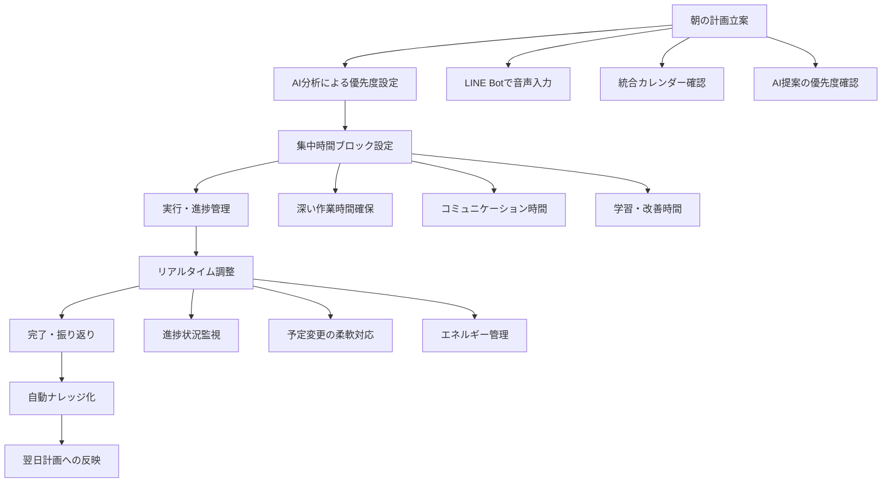
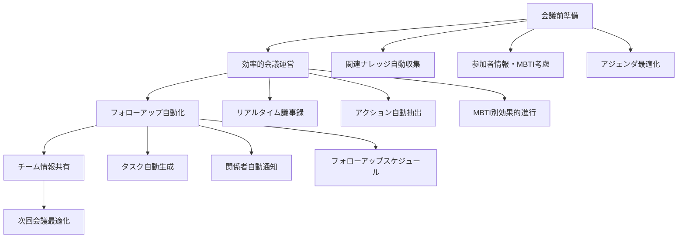
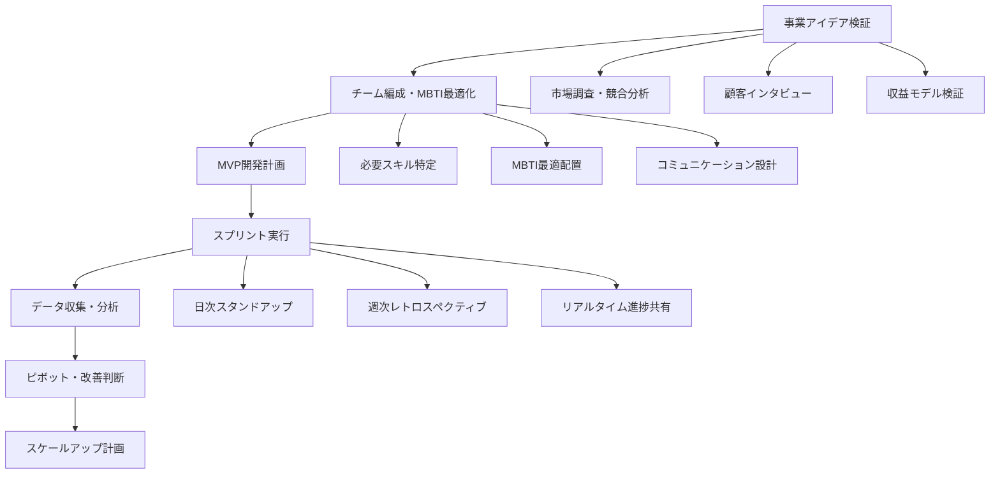
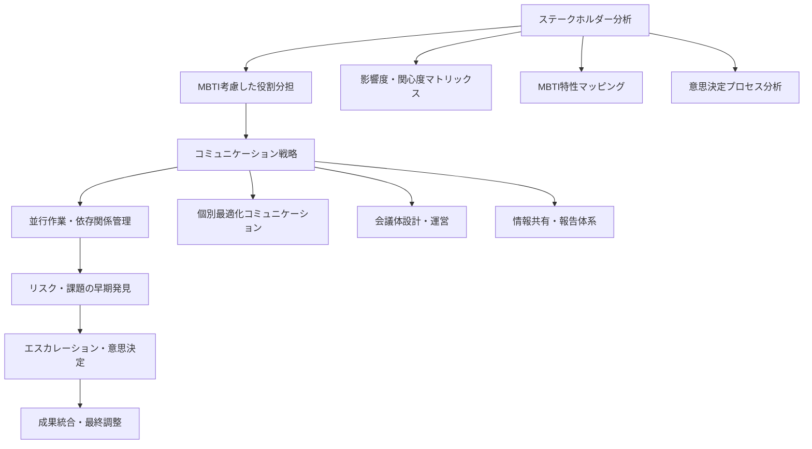
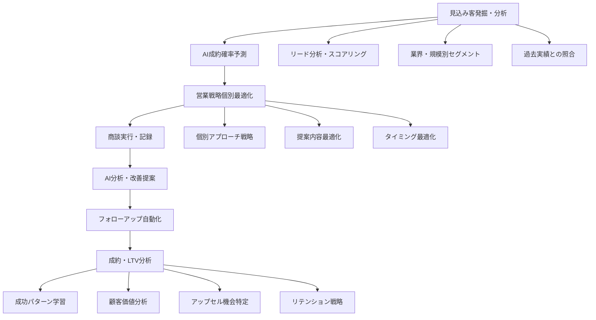
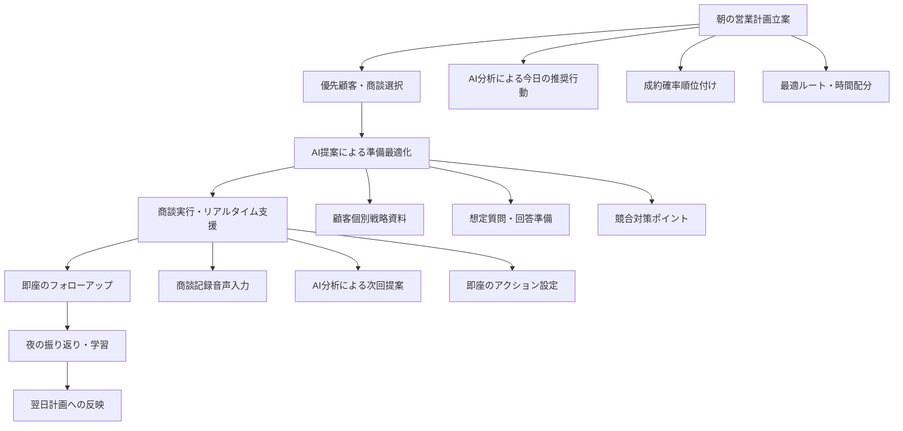
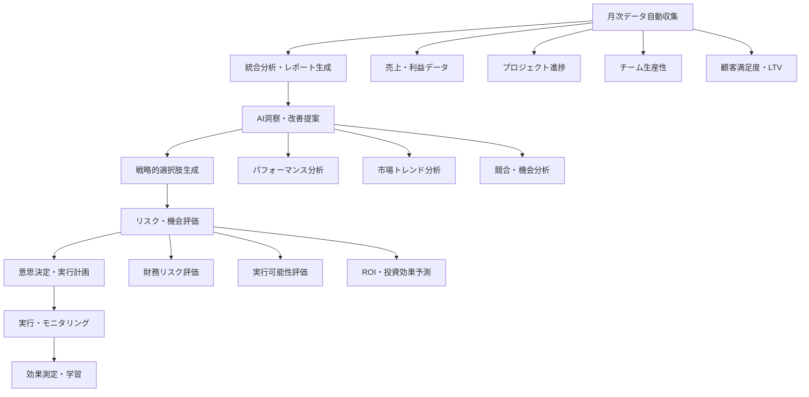
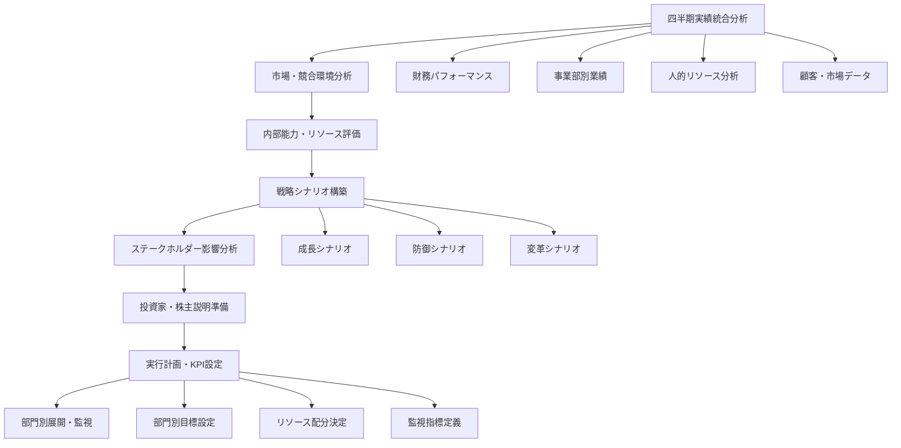

# Find To Do Management App - 業務シナリオ別フロー

## 1. 個人生産性向上シナリオ

### 1.1 フリーランス・個人事業主の1日最適化フロー



#### 具体的な1日の流れ

**6:30 AM - 朝の計画立案**
```
📱 LINE Bot活用例:
「おはよう @find-todo 今日の予定を確認して、優先タスクを教えて」

🤖 AI応答:
「おはようございます！今日の状況分析結果です📊

📅 今日の予定:
• 10:00-11:30 クライアントA打ち合わせ
• 14:00-15:00 企画書レビュー会議  
• 16:30-17:30 新規提案作成

🎯 AI分析による優先タスク:
1. 🔥 企画書最終化 (期限今日・高重要度)
2. ⭐ 新規提案の下書き (明日プレゼン準備)
3. 📧 見積もり回答3件 (週内期限)

💡 最適スケジュール提案:
• 8:00-9:30: 企画書最終化 (集中力ピーク時)
• 9:30-10:00: メール処理・準備
• 午後: 会議の合間に新規提案作成
• 夕方: 見積もり作業」
```

**8:00 AM - 集中作業タイム**
```
🎯 深い作業モード設定

システム自動調整:
• 通知・アラートを最小限に設定
• LINE Botを「集中モード」に切り替え
• カレンダーブロックで他の予定をブロック
• AI分析で最適な作業環境を提案

集中作業支援機能:
• 25分集中 + 5分休憩のポモドーロタイマー
• 進捗を可視化するタスクバー
• 関連ナレッジの自動表示
• 過去の類似作業時間を参考表示
```

**12:00 PM - 中間振り返り・調整**
```
📊 午前中の振り返り

自動分析結果:
✅ 完了タスク: 企画書最終化 (予定時間+15分)
✅ 完了タスク: メール処理10件
⏰ 進行中: 新規提案の構成検討

💡 午後の最適化提案:
• 企画書作成が予想より長引いたため、新規提案の時間を調整
• 14:00の会議前に15分の準備時間を確保
• 見積もり作業を夕方に集約して効率化

🔄 スケジュール自動調整:
• 17:30-18:30: 見積もり作業集中タイム
• 19:00-20:00: 明日の新規提案プレゼン準備
```

**18:00 PM - 1日の完了・振り返り**
```
📈 1日の成果レビュー

🎯 今日の実績:
✅ 企画書最終化完了 → クライアント承認獲得
✅ 見積もり3件回答完了 → 1件受注見込み
✅ 新規提案75%完成 → 明日プレゼン準備OK

📊 AI分析による学習:
• 集中作業時間: 平均より20%効率的
• 最も生産性が高い時間: 8:00-10:00
• 改善ポイント: 会議間の移動時間をより考慮

🧠 自動ナレッジ化:
「企画書作成プロセスの効率化手法」として自動記録
• 構成テンプレートの活用で30%時短
• クライアント過去資料の事前確認の重要性
• レビュー会議での論点整理方法

💡 明日への改善提案:
• 9:00開始で新規提案プレゼン最終準備
• 10:30-12:00の新規案件検討時間確保
• 午後は軽いタスクで調整可能な時間設計
```

### 1.2 会社員・チームメンバーの効率化シナリオ

#### 会議・コラボレーション最適化フロー



**会議効率化の具体例:**

```
🎯 週次チーム会議の最適化

📋 会議前準備 (自動化):
1. 関連プロジェクト進捗の自動収集
2. 前回会議アクションの進捗確認
3. 参加者のMBTI特性に基づく進行プラン生成
4. 過去類似会議の成功パターン提示

👥 MBTI考慮した会議進行:
• 田中さん(ENTJ): 結論重視、効率的進行
• 佐藤さん(ISFJ): 全員の意見確認、詳細フォロー
• 山田さん(ENTP): アイデア発散、創造的議論
• 鈴木さん(ISTJ): 具体的計画、実行可能性確認

⚡ リアルタイム議事録・アクション抽出:
会議中の発言から自動的に：
• 決定事項の抽出
• アクション項目の特定
• 担当者・期限の記録
• 次回会議での確認事項整理

📤 自動フォローアップ:
会議終了30分後：
• 議事録の自動配信
• 各担当者へのタスク自動通知
• プロジェクト管理ツールへの自動反映
• 次回会議のアジェンダ素案生成
```

## 2. チームプロジェクト成功シナリオ

### 2.1 スタートアップ企業の新規事業立ち上げフロー



#### 具体的プロジェクト進行例

**Phase 1: 事業アイデア検証（4週間）**

```
🚀 新規SaaSサービス開発プロジェクト

📊 初期設定・チーム編成:
プロジェクト名: "中小企業向け在庫管理SaaS"
予算: ¥5,000,000
期間: 6ヶ月（MVP 3ヶ月 + 改善 3ヶ月）

👥 AI最適チーム編成:
• 田中さん (ENTJ) - プロジェクトマネージャー・戦略統括
  強み: 全体戦略、意思決定、チーム統率
• 佐藤さん (ENFP) - マーケティング・顧客開発
  強み: 創造性、顧客共感、アイデア創出
• 山田さん (ISTJ) - 技術リード・開発統括
  強み: 計画性、品質管理、安定稼働
• 鈴木さん (ISFJ) - UI/UX・品質保証
  強み: ユーザー視点、細部配慮、チーム調整

🎯 MBTI分析による成功予測:
• チーム成功確率: 88%
• 強み: 戦略性(ENTJ) + 創造性(ENFP) + 実行力(ISTJ) + 品質(ISFJ)
• 注意点: ENTJとENFPの方向性統一、ISFJのストレス管理
```

**週次スプリント運営（MBTI最適化）:**

```
📅 週次スプリント設計

🎯 月曜日 - スプリント計画会議 (ENTJ主導):
• 目標設定・優先度決定: 田中さんが効率的に進行
• 技術要件確認: 山田さんが詳細チェック
• ユーザー要件確認: 佐藤さんが顧客視点提供
• 品質基準設定: 鈴木さんが基準・プロセス整理

💡 水曜日 - 中間レビュー (ENFP主導):
• アイデア発散・改善提案: 佐藤さんがファシリテート
• 創造的問題解決: 全員がブレインストーミング
• 顧客フィードバック共有: マーケット視点での調整

📊 金曜日 - スプリントレビュー (ISTJ主導):
• 成果物レビュー: 山田さんが技術品質確認
• 進捗・課題整理: データに基づく客観的評価
• 次週計画策定: 具体的・実行可能な計画立案

🤝 随時 - チーム調整 (ISFJ主導):
• メンバー間の調整: 鈴木さんが感情・関係性ケア
• 品質・ユーザビリティチェック: 継続的改善
• チームモチベーション維持: 個別フォロー
```

### 2.2 大企業の部門横断プロジェクト管理フロー

#### 複雑なステークホルダー管理・調整フロー



**大規模プロジェクトの実例:**

```
🏢 全社DX推進プロジェクト

📈 プロジェクト概要:
• 規模: 全社5,000名対象
• 期間: 18ヶ月
• 予算: ¥3億円
• 部門: IT、人事、財務、営業、製造の5部門

👥 部門代表者MBTI分析・最適化:

🎯 IT部門 - 山田部長 (INTJ):
• 特性: 戦略的思考、技術的専門性、完璧主義
• 役割: 技術アーキテクチャ設計、システム統合
• コミュニケーション: 詳細資料、論理的説明重視
• 会議: 事前資料配布、効率的進行

💼 人事部門 - 田中部長 (ESFJ):
• 特性: 人間関係重視、変化への慎重さ、組織調和
• 役割: 変更管理、研修企画、社員サポート
• コミュニケーション: 対面重視、感情配慮
• 会議: 全員参加型、合意形成プロセス

💰 財務部門 - 佐藤部長 (ISTJ):
• 特性: 正確性、リスク管理、プロセス重視
• 役割: 予算管理、ROI測定、リスク評価
• コミュニケーション: 数値・事実ベース
• 会議: 詳細報告、段階的承認

🎯 営業部門 - 鈴木部長 (ESTP):
• 特性: 行動力、現実的、顧客志向
• 役割: 顧客影響分析、業務継続性確保
• コミュニケーション: 簡潔、結果重視
• 会議: 短時間、アクション中心

🏭 製造部門 - 高橋部長 (ISFP):
• 特性: 柔軟性、品質重視、チーム協調
• 役割: 現場オペレーション調整、品質保証
• コミュニケーション: 個別対話、実例重視
• 会議: 小グループ、具体的議論
```

**MBTI特性を活かした会議体運営:**

```
📋 最適化された会議体制

🎯 全体戦略会議 (月1回・2時間):
• 主導: 山田部長(INTJ) - 戦略的全体設計
• 参加: 全部門代表者
• 進行: 事前資料配布→論点整理→意思決定
• 成果: 戦略方針決定、重要課題解決

💡 実務調整会議 (週1回・1時間):
• 主導: 田中部長(ESFJ) - 人間関係・調整
• 参加: 実務担当者レベル
• 進行: 全員発言→課題共有→解決策検討
• 成果: 実務課題解決、チーム連携強化

📊 進捗報告会議 (週1回・30分):
• 主導: 佐藤部長(ISTJ) - 数値・進捗管理
• 参加: プロジェクトマネージャー
• 進行: 数値報告→課題特定→アクション決定
• 成果: 進捗管理、リスク早期発見

⚡ 緊急対応会議 (随時・30分):
• 主導: 鈴木部長(ESTP) - 迅速な意思決定
• 参加: 関係者のみ
• 進行: 問題確認→解決策検討→即決
• 成果: 迅速問題解決、業務継続性確保

🔧 現場調整会議 (随時・1時間):
• 主導: 高橋部長(ISFP) - 現場視点・品質
• 参加: 現場担当者
• 進行: 現場課題→具体的対策→品質確認
• 成果: 現場課題解決、品質向上
```

## 3. 営業成果最大化シナリオ

### 3.1 B2B営業チームの売上向上フロー



#### 営業チーム月次成果向上プロセス

**月初: AI分析による戦略立案**

```
📊 営業チーム月次戦略会議

🎯 先月実績AI分析:
• 総売上: ¥45,000,000 (目標比112%)
• 成約率: 28% (前月比+5%)
• 平均商談期間: 42日 (前月比-8日)
• LTV上位顧客: 15社 (全体の68%売上構成)

🤖 AI分析による成功要因:
1. 製造業向けアプローチの効果向上 (+15%)
2. 技術的優位性訴求の成約率改善 (+12%)
3. 決裁者早期アプローチの期間短縮効果
4. 競合対策資料の差別化効果

📈 今月の最適化戦略:
• 製造業リードの優先度を最高レベルに設定
• 技術的優位性を前面に出した提案資料作成
• 初回商談での決裁者同席を標準化
• 競合分析の更新・強化

🎯 個別担当者最適化:
田中営業 (ENTJ):
• 強み: 戦略的提案、大型案件統括
• 今月focus: 年間¥10M以上の大型案件3件
• AI提案: 決裁者層への直接アプローチ強化

佐藤営業 (ESFJ):
• 強み: 関係構築、継続フォロー
• 今月focus: 既存顧客アップセル 5件
• AI提案: 顧客満足度調査→アップセル提案

山田営業 (ESTP):
• 強み: 行動力、新規開拓
• 今月focus: 新規リード20件→商談10件
• AI提案: スピード重視の短期成約戦略
```

**週次: 進捗管理・軌道修正**

```
📋 営業チーム週次レビュー

📊 今週の実績・進捗:
田中営業:
• 大型案件A: 成約確率75%→85% (AI予測)
• 大型案件B: 競合情報入手、対策強化中
• 大型案件C: 決裁者面談設定完了

佐藤営業:
• 既存顧客アップセル: 2件提案中
• 顧客満足度調査: 8社完了、全て高評価
• 新規アップセル機会: 3件発見

山田営業:
• 新規リード獲得: 15件 (目標20件)
• 商談設定: 8件 (目標10件)
• 短期成約: 2件完了

🤖 AI分析・改善提案:
田中営業への提案:
「大型案件Aの成約確率向上のため、技術部門との合同プレゼンを推奨」

佐藤営業への提案:
「顧客C社で追加ニーズが発見されています。来週中のアプローチを推奨」

山田営業への提案:
「リード獲得ペースが遅れています。製造業イベント参加を検討してください」
```

### 3.2 個人営業マンの売上倍増フロー

#### AIサポートによる営業効率化



**営業マン1日の完全最適化例:**

```
👨‍💼 トップ営業マン・高橋さんの1日

📱 6:30 AM - 朝の営業戦略立案
LINE Bot: 「おはよう @find-todo 今日の営業計画を最適化して」

🤖 AI分析結果:
「高橋さん、おはようございます！今日の最適営業プランです

🎯 今日の推奨アクション:
1. A社最終提案 (成約確率92%) - 最優先
2. B社フォローアップ (確率65%) - 午前中推奨
3. C社新規商談 (確率45%) - 午後、時間に余裕時

📍 最適ルート:
9:00 A社(新宿) → 11:00 B社(池袋) → 14:00 C社(渋谷)
移動時間込み: 7時間 (通常より1時間短縮)

💡 成功確率向上ポイント:
• A社: 競合D社の弱点を明確化した比較表持参
• B社: 先月の成功事例を事前送付済み、効果確認
• C社: 業界特化ソリューションを前面に」

🎯 9:00 AM - A社最終提案商談
事前準備 (AI支援):
• 過去商談履歴: 5回、決裁者田中部長の関心事項
• 競合分析: D社提案の弱点3点、差別化ポイント
• ROI計算書: A社専用、年間2,400万円コスト削減効果
• 想定質問5つ＋回答準備

商談中 (AI支援):
• 重要発言の音声メモ自動記録
• 田中部長の反応分析 (MBTI: ENTJ特性考慮)
• リアルタイム成約確率更新: 92%→97%

商談後即座フォローアップ:
「田中部長、本日はありがとうございました。
ご質問いただいた導入スケジュールの詳細を添付いたします。
来週火曜日までにご検討いただき、木曜日に最終ご確認でお伺いします。」

💎 11:30 AM - B社商談結果
成果: アップセル提案受諾、年間契約額150%増加
AI学習ポイント: 成功事例の事前共有が効果的
次回アクション: 導入支援チームとの引き継ぎ設定

🚀 14:00 PM - C社新規商談
AI事前分析活用:
• C社業界の成功事例3件を前面提示
• 競合他社との差別化ポイント明確化
• 段階的導入プランによるリスク軽減提案

商談結果: 次回詳細提案の機会獲得
成約確率: 45%→70%に向上

📊 18:00 PM - 1日の振り返り・明日計画
AI分析による今日の成果:
✅ A社: 最終契約確率97% (来週最終確認)
✅ B社: アップセル成約 ¥1,800,000/年
✅ C社: 成約確率70%向上、次回提案確定

🧠 学習・改善ポイント:
• 事前成功事例共有が全商談で効果的
• ENTJ特性顧客には数値・効率性重視が重要
• 業界特化提案が差別化に極めて有効

📅 明日の最優先アクション:
1. A社契約書準備・最終調整
2. C社詳細提案資料作成
3. 新規リード3件の初回アプローチ
```

## 4. 経営判断支援シナリオ

### 4.1 中小企業経営者の月次意思決定フロー



#### 経営月次レビューの完全自動化

**月初: 統合経営ダッシュボード分析**

```
📊 統合経営ダッシュボード - 2024年10月レビュー

💰 財務パフォーマンス:
• 月間売上: ¥28,500,000 (前月比+12%, 予算比+8%)
• 粗利益: ¥17,100,000 (粗利率60%)
• 営業利益: ¥5,700,000 (営業利益率20%)
• キャッシュフロー: +¥4,200,000

👥 チーム・生産性分析:
• プロジェクト完了率: 94% (目標90%)
• チーム満足度: 8.2/10 (前月比+0.3)
• 個人生産性向上率: +15% (MBTI最適化効果)
• ナレッジ生成: 48件 (過去最高)

📈 顧客・マーケット分析:
• 新規獲得: 12社 (目標10社)
• 既存顧客LTV平均: ¥2,650,000 (+8%)
• 顧客満足度: 9.1/10
• 解約率: 1.2% (業界平均3.5%)

🤖 AI統合分析・洞察:
✅ 成功要因:
1. MBTI最適化チーム編成が生産性向上に寄与
2. AI営業支援で成約率28%→35%に改善
3. 自動ナレッジ化で品質・効率が大幅向上
4. LTV分析に基づく顧客戦略が効果的

⚠️ 注意すべき要因:
1. 売上成長に対するチーム拡大のタイミング
2. 高収益顧客への依存度増加リスク
3. 新しい技術トレンドへの対応必要性
4. 競合の価格攻勢への対応検討

💡 AI推奨戦略オプション:
A. 積極的成長戦略 (投資拡大)
B. 安定成長戦略 (現状最適化)
C. 新領域展開戦略 (多角化)
```

**戦略オプションの詳細分析:**

```
🎯 戦略オプション詳細分析

💪 オプションA: 積極的成長戦略
投資規模: ¥15,000,000
期間: 6ヶ月
実行内容:
• チーム拡大: エンジニア3名、営業2名追加
• 新技術導入: AI機能強化、自動化拡張
• マーケティング強化: 新規チャネル開拓

予測結果:
• 売上予測: +40% (¥40M/月目標)
• 利益予測: +35% (投資回収期間8ヶ月)
• 成功確率: 78%
• リスク: 人材採用リスク、競合反応

💡 オプションB: 安定成長戦略
投資規模: ¥5,000,000
期間: 3ヶ月
実行内容:
• 既存サービス改善・最適化
• 顧客満足度向上施策
• 業務効率化・自動化推進

予測結果:
• 売上予測: +15% (¥33M/月目標)
• 利益予測: +25% (利益率改善効果)
• 成功確率: 92%
• リスク: 成長機会の逸失可能性

🚀 オプションC: 新領域展開戦略
投資規模: ¥25,000,000
期間: 12ヶ月
実行内容:
• 新サービス開発・市場投入
• 新規市場セグメント開拓
• 戦略的パートナーシップ構築

予測結果:
• 売上予測: +60% (¥45M/月目標)
• 利益予測: +45% (新市場効果)
• 成功確率: 65%
• リスク: 技術・市場リスク大

🎯 AI推奨意思決定:
推奨戦略: オプションA (積極的成長戦略)
理由:
1. 現在の好調な業績トレンドを活かせる
2. チームのモチベーション・能力が高い
3. 市場機会が拡大している
4. 競合優位性を拡大できる

実行条件:
• 優秀な人材確保が前提
• 段階的投資によるリスク管理
• 月次モニタリングによる軌道修正準備
```

### 4.2 上場企業役員の四半期戦略フロー

#### 統合データによる中長期戦略立案



**四半期戦略レビューの実例:**

```
📈 2024年Q3 統合戦略レビュー

🏢 全社業績サマリー:
• 売上: ¥12.5億 (前年同期比+18%)
• 営業利益: ¥2.1億 (営業利益率16.8%)
• EBITDA: ¥2.8億 (EBITDA margin 22.4%)
• ROE: 15.2% (目標15%達成)

📊 事業部別パフォーマンス:
ソフトウェア事業: ¥8.2億 (+22%)
• SaaS ARR: ¥9.6億 (前年比+35%)
• チャーンレート: 2.1% (業界平均5.2%)
• LTV/CAC比率: 4.2 (健全レベル)

コンサルティング事業: ¥3.1億 (+8%)
• 平均案件規模: ¥450万 (+12%)
• 利用率: 78% (目標75%)
• 顧客満足度: 9.3/10

新規事業: ¥1.2億 (+180%)
• AI/ML サービス急成長
• 市場シェア: 3.2% (業界5位)
• 投資回収: 順調 (計画比+20%)

🌍 市場・競合環境分析:
市場成長: DX市場 +25%/年 (継続成長予測)
競合動向: 
• 大手A社: 価格競争激化、シェア奪取攻勢
• スタートアップB社: 新技術で差別化、注目度上昇
• 海外C社: 日本市場参入準備、脅威レベル中

🎯 戦略シナリオ評価:

シナリオ1: 積極的市場拡大
• 投資額: ¥5億/年
• 目標: 売上+40%, 市場シェア+3%
• 成功確率: 70%
• リスク: 競合反応、投資回収期間

シナリオ2: 収益性重視・最適化
• 投資額: ¥2億/年
• 目標: 利益率+5%, ROE+2%
• 成功確率: 85%
• リスク: 成長機会逸失

シナリオ3: 新領域・M&A戦略
• 投資額: ¥15億/年
• 目標: 事業ポートフォリオ拡大
• 成功確率: 60%
• リスク: 統合リスク、文化的課題

💡 統合AI分析による推奨戦略:
「ハイブリッド戦略」を推奨

推奨戦略構成:
• 既存事業: 収益性重視最適化 (60%リソース)
• 成長投資: 新規事業・技術強化 (30%リソース)
• 戦略的M&A: 小規模買収2-3件 (10%リソース)

期待効果:
• 売上成長: +25%/年 (バランス型成長)
• 利益率維持: 16-18% レンジ
• リスク分散: 複数事業での安定性
• 株主価値向上: ROE 18%目標

実行計画:
Q4: 既存事業最適化、M&A候補選定
Q1: 新規投資実行、小規模買収1件
Q2: 統合効果測定、戦略調整
Q3: 次期中期計画策定
```

---

これらの業務シナリオフローにより、Find To Do Management Appの統合機能を最大限活用し、個人から企業まで、あらゆるレベルでの業務最適化と戦略的成果創出を実現できます。