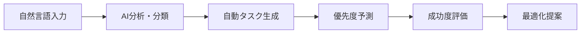
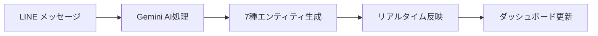
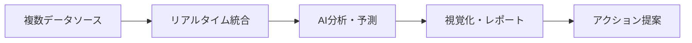
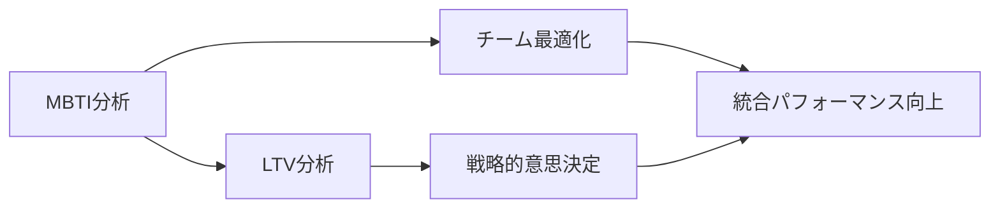

# Find To Do Management App - ユーザーフロー総合ガイド

## 📋 概要

このディレクトリには、Find To Do Management Appの全機能を100%活用するためのユーザーフローが体系的に整理されています。新規ユーザーから上級ユーザーまで、段階的に機能を習得し、最終的にはAI・統合機能を活用した高度な業務最適化を実現できるよう設計されています。

## 📁 ドキュメント構成

### [01_BASIC_USER_FLOWS.md](./01_BASIC_USER_FLOWS.md)
**基本ユーザーフロー**
- 初回セットアップから日常利用まで
- 機能習得の段階的プロセス
- トラブルシューティング・サポート

### [02_INTEGRATION_FLOWS.md](./02_INTEGRATION_FLOWS.md)
**統合活用フロー**  
- LINE Bot + ダッシュボード連携
- AI分析結果の活用方法
- リアルタイム更新の体験設計

### [03_ADVANCED_FLOWS.md](./03_ADVANCED_FLOWS.md)
**高度活用フロー**
- MBTI分析によるチーム最適化
- LTV分析による戦略的意思決定  
- AI機能による業務自動化

### [04_BUSINESS_SCENARIOS.md](./04_BUSINESS_SCENARIOS.md)
**業務シナリオ別フロー**
- 個人生産性向上シナリオ
- チームプロジェクト成功シナリオ
- 営業成果最大化シナリオ
- 経営判断支援シナリオ

## 🎯 対象ユーザー

### 👤 個人ユーザー
- **フリーランス・個人事業主**: 効率的な時間管理・生産性向上
- **会社員・チームメンバー**: 日常業務の最適化・スキルアップ
- **営業担当者**: AI支援による成果向上・顧客管理

### 👥 チーム・組織ユーザー  
- **チームリーダー**: MBTI分析によるチーム最適化
- **プロジェクトマネージャー**: 統合機能による進捗管理
- **経営者・マネージャー**: データ分析による戦略的意思決定

## ⭐ システムの主要統合機能

### 🤖 AI駆動の自動化


### 📱 LINE Bot統合


### 📊 統合分析ダッシュボード


### 💼 エンタープライズ機能


## 🎯 学習パス・習得レベル

### Level 1: 基本機能習得（1週間）
```
✅ タスク・カレンダー基本操作
✅ LINE Bot基本コマンド
✅ ダッシュボード閲覧・確認
```

### Level 2: 統合機能活用（2週間）
```
✅ リアルタイム連携体験
✅ 自動ナレッジ化活用
✅ 統合カレンダー活用
```

### Level 3: AI機能活用（1ヶ月）
```
✅ AI分析結果の理解・活用
✅ 予測機能による改善実感
✅ 自動化設定・カスタマイズ
```

### Level 4: 高度分析活用（2-3ヶ月）
```
✅ MBTI分析チーム最適化
✅ LTV分析戦略的活用
✅ 包括的業務最適化実現
```

## 📈 期待される成果・効果

### 個人レベルの成果
- **生産性向上**: 平均30-50%の作業効率改善
- **時間管理**: AI分析による最適なスケジューリング
- **スキル向上**: 自動ナレッジ化による継続学習

### チームレベルの成果  
- **チーム生産性**: MBTI最適化による20-30%向上
- **プロジェクト成功率**: AI予測による85%以上達成
- **コミュニケーション効率**: 個性を活かした協力体制

### 組織レベルの成果
- **売上向上**: 営業AI支援で成約率25-40%改善
- **顧客価値**: LTV分析による戦略的顧客管理
- **意思決定**: データドリブンな経営判断支援

## 🚀 クイックスタートガイド

### 新規ユーザー（初回30分）
1. **アカウント作成・認証** (5分)
2. **基本プロフィール・MBTI設定** (10分)  
3. **LINE Bot接続・テスト** (5分)
4. **初回タスク作成・確認** (10分)

### 既存ユーザー（機能拡張）
1. **現在の利用状況確認** (5分)
2. **未活用機能の特定** (10分)
3. **段階的機能追加** (週単位)
4. **効果測定・最適化** (月単位)

## 💡 ベストプラクティス

### 効果的な活用のポイント
1. **段階的習得**: 無理をせず、レベル1から順次習得
2. **継続的利用**: 日常的な利用で効果を最大化
3. **チーム連携**: 個人利用からチーム活用へ発展
4. **データ蓄積**: 継続利用でAI分析精度向上

### 避けるべき使い方
1. **機能の単独利用**: 統合効果を活かさない使い方
2. **手動操作重視**: 自動化機能を活用しない
3. **データ分散**: 統合ダッシュボードを活用しない
4. **学習機会逸失**: ナレッジ化機能を軽視

## 🔧 サポート・トラブルシューティング

### よくある質問・問題
- **LINE Bot応答なし**: 接続確認・再設定手順
- **データ同期されない**: ネットワーク・ブラウザ確認
- **AI分析結果が出ない**: データ量・設定確認

### サポートリソース
- **システム内ヘルプ**: リアルタイムガイダンス
- **ドキュメント**: 詳細な操作・設定ガイド
- **コミュニティ**: ユーザー同士の情報共有

---

## 🎯 次のステップ

1. **現在の利用レベル確認**: どのレベルに該当するか確認
2. **目標設定**: 達成したい成果・レベルを明確化  
3. **適切なフロー選択**: 目標に応じたユーザーフローを選択
4. **段階的実践**: 無理のないペースで機能習得・活用

**Find To Do Management Appの統合機能を活用し、個人・チーム・組織レベルでの革新的な生産性向上を実現してください！**