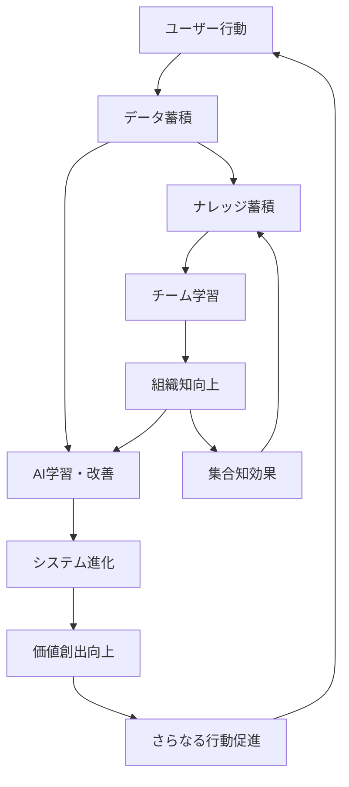

# Find To Do Management App - 限界突破完全ガイド
## システムポテンシャル100%超活用のための必須行動指針

---

## 🚀 概要：なぜ100%超のポテンシャルが可能なのか

Find To Do Management Appは、単なるタスク管理ツールではなく、**自己進化する知的統合システム**です。ユーザーの行動・データ・学習が相互作用することで、投入した努力以上の価値を創出する「**複利効果システム**」として機能します。

### 複利効果の仕組み


---

## 📊 Phase 1: 基盤構築期（最初の2週間）- データ基盤の完全構築

### 🎯 必須行動チェックリスト

#### 1.1 完全プロフィール設定（Day 1）
```
✅ 基本情報の完全入力
□ 名前、役職、所属組織の詳細
□ 業界、企業規模、事業内容
□ 個人の専門領域・スキル
□ 目標・KPI（定量的に設定）

✅ MBTI診断の完全実施
□ 公式16タイプ診断の完了
□ 認知機能の詳細理解
□ 個人特性レポートの確認
□ 強み・弱みの自己認識

✅ 利用目的の明確化
□ 短期目標（3ヶ月以内）
□ 中期目標（1年以内）
□ 長期ビジョン（3年以内）
□ 成功指標の数値化
```

#### 1.2 LINE Bot完全連携（Day 2-3）
```
✅ 基本接続・認証
□ QRコード連携完了
□ アカウント認証確認
□ 初回テスト送信成功

✅ 高度機能の有効化
□ 音声メッセージ対応設定
□ 画像・ファイル送信テスト
□ セッション管理の理解
□ エラー時の復旧方法確認

✅ 自然言語パターンの学習
□ 基本的な7種エンティティ作成テスト
□ 複雑な依頼の段階的入力体験
□ AI理解精度の確認・調整
□ 個人的な表現パターンの学習促進
```

#### 1.3 初期データ入力の戦略的実施（Day 4-7）
```
✅ 既存タスク・プロジェクトの完全移行
□ 現在進行中の全タスク（最低20件）
□ 過去3ヶ月の完了タスク（学習データとして）
□ 継続中プロジェクト（詳細情報含む）
□ 将来計画・アイデア（アーカイブ）

✅ 人脈・関係性データの構築
□ 重要な取引先・顧客（最低10社）
□ チームメンバー・同僚（MBTI情報も）
□ 過去の営業・商談履歴
□ 人間関係の特性・相性情報

✅ 過去実績データの投入
□ 過去1年の主要成果・プロジェクト
□ 成功・失敗事例の詳細記録
□ 学習・スキル習得履歴
□ 重要な意思決定・その結果
```

#### 1.4 カスタマイズ・最適化設定（Day 8-14）
```
✅ 通知・アラート最適化
□ 重要度別通知設定
□ 時間帯別通知調整
□ 緊急度判定基準のカスタマイズ
□ フォーカスモード設定

✅ ダッシュボード個人化
□ 重要メトリクスの選択
□ 表示優先度の調整
□ リアルタイム更新頻度設定
□ 色・レイアウトのカスタマイズ

✅ AI分析パラメータ調整
□ 成功度評価基準の調整
□ 優先度判定ロジックの最適化
□ 予測期間・精度の設定
□ 学習データの重み付け調整
```

---

## 🔥 Phase 2: 加速成長期（2週間-2ヶ月）- システム統合の深化

### 🎯 高度活用必須行動

#### 2.1 LINE Bot活用の習熟（Week 3-4）
```
✅ 毎日最低10回のLINE Bot活用
□ 朝の計画立案（1回）
□ 移動中のタスク追加（2-3回）
□ 会議後の記録・フォローアップ（2-3回）
□ 夕方の振り返り・明日準備（1-2回）
□ 突発的なアイデア・メモ（2-3回）

✅ 複雑な要求の段階的入力マスター
□ プロジェクト全体の一括設定
□ 複数関係者を含む予定調整
□ 条件付き・繰り返しタスクの作成
□ 営業プロセス全体の管理設定

✅ 音声・画像活用の完全習得
□ 音声メッセージでの長文入力
□ 会議資料・ホワイトボードの画像送信
□ 名刺・資料の自動デジタル化
□ 移動中・外出先での効率活用
```

#### 2.2 AI分析結果の戦略的活用（Week 5-8）
```
✅ 日次AI分析の必須確認・実行
□ 毎朝の優先度AI提案確認（100%実行）
□ タスク成功度予測の活用判断
□ リスク要因への事前対策実施
□ AI提案アクションの80%以上実行

✅ 週次AI洞察の深い理解・活用
□ 生産性トレンド分析の詳細確認
□ ボトルネック特定・改善アクション
□ 成功パターンの意識的再現
□ 予測精度向上のためのフィードバック

✅ 月次戦略レベルAI活用
□ 長期目標達成確率の定期確認
□ キャリア・事業戦略へのAI提案活用
□ リソース配分最適化の実行
□ ROI・成果予測に基づく意思決定
```

#### 2.3 自動ナレッジ化システムの完全活用（継続）
```
✅ ナレッジ生成率90%以上の達成
□ 重要タスク完了時の詳細記録（必須）
□ 学習・発見の即座な記録
□ 失敗・課題の分析的記録
□ 成功要因の体系的記録

✅ ナレッジ活用の戦略的実施
□ 新規タスク開始前の関連ナレッジ確認
□ 過去事例の応用・改善実施
□ チーム内ナレッジ共有の積極的実施
□ 外部への知識発信・フィードバック獲得

✅ ナレッジ品質の継続向上
□ 生成されたナレッジの定期レビュー
□ 追加情報・改善点の補完
□ 関連性・検索性の向上
□ 活用実績に基づく価値評価更新
```

---

## 💎 Phase 3: エキスパート統合期（2-6ヶ月）- 高度機能の完全統合

### 🎯 システム統合必須行動

#### 3.1 MBTI分析の組織レベル活用
```
✅ 個人MBTI理解の深化（Month 2-3）
□ 16タイプの詳細特性理解
□ 認知機能の発達・活用状況分析
□ ストレス状況・対処法の特定
□ 成長領域・開発ポイントの明確化

✅ チーム最適化の実践実施（Month 3-4）
□ チームメンバー全員のMBTI把握
□ 相性・補完関係の分析・活用
□ 役割分担の最適化実施
□ コミュニケーション方法の個別最適化

✅ 組織力最大化の戦略実行（Month 4-6）
□ プロジェクト編成の戦略的最適化
□ 会議・意思決定プロセスの最適化
□ 人材配置・昇進判断へのMBTI活用
□ 組織文化・風土改善への活用
```

#### 3.2 LTV分析による戦略的経営
```
✅ 顧客LTV分析の完全実施（Month 2-3）
□ 全顧客のLTV計算・分析完了
□ セグメント別戦略の策定・実行
□ 投資判断基準の明確化・適用
□ 価格戦略の最適化実施

✅ 予測LTVの戦略的活用（Month 3-4）
□ 新規顧客獲得戦略の最適化
□ マーケティング投資の効率化
□ 営業リソース配分の最適化
□ サービス・製品開発への反映

✅ LTVドリブン経営の確立（Month 4-6）
□ 経営判断・投資判断へのLTV活用
□ 事業戦略・成長戦略へのLTV統合
□ ステークホルダー説明でのLTV活用
□ 競合優位性構築へのLTV活用
```

#### 3.3 営業AI自動化の完全活用
```
✅ AI成約確率予測の100%活用（Month 2-3）
□ 全商談の成約確率AI分析実施
□ 予測結果に基づく戦略調整（100%実行）
□ 成約要因・失注要因の詳細分析
□ 個人営業スタイルの最適化

✅ 営業自動化システムの完全統合（Month 3-4）
□ フォローアップ自動化の100%活用
□ 商談記録・分析の完全自動化
□ 提案書・資料作成の効率化
□ 顧客コミュニケーションの最適化

✅ 営業チーム全体の最適化（Month 4-6）
□ チーム成績向上のAI分析活用
□ 個人別強み・弱みの特定・強化
□ 営業プロセス全体の最適化
□ 売上予測・目標設定の精度向上
```

---

## 🌟 Phase 4: マスター統合期（6ヶ月-1年）- 組織変革レベルの活用

### 🎯 組織変革必須行動

#### 4.1 統合ダッシュボードによる経営判断
```
✅ リアルタイム経営判断の確立（Month 6-8）
□ 日次経営判断の90%をダッシュボード基準
□ 週次戦略会議での統合データ活用
□ 月次業績評価の完全データドリブン化
□ 四半期戦略策定の統合分析活用

✅ 予測経営の実践（Month 8-10）
□ 売上・利益予測の精度90%以上達成
□ リスク予測・事前対策の実施
□ 機会予測・戦略的投資判断
□ 競合・市場予測の戦略への統合

✅ データドリブン組織文化の確立（Month 10-12）
□ 全社員のデータ活用スキル向上
□ 意思決定プロセスの完全透明化
□ 成果・評価基準のデータ化
□ 学習・改善文化の組織浸透
```

#### 4.2 知識創造組織への変革
```
✅ 組織ナレッジの戦略的活用（Month 6-8）
□ 全部門ナレッジの体系的整理・活用
□ 新人教育・スキル向上への活用
□ イノベーション・改善提案への活用
□ 外部発信・ブランディングへの活用

✅ 学習組織化の完全実現（Month 8-10）
□ 失敗・課題からの学習システム確立
□ 成功パターンの組織的共有・活用
□ 継続的改善プロセスの自動化
□ 組織学習速度の最大化

✅ 知的資産経営の確立（Month 10-12）
□ 組織知識の資産価値評価・管理
□ 知的財産・ノウハウの戦略的活用
□ 競合優位性の知識ベース構築
□ 持続的競争優位の確立
```

---

## 🚀 Phase 5: 限界突破期（1年以上）- システム進化への貢献

### 🎯 システム進化貢献行動

#### 5.1 AI学習への戦略的貢献
```
✅ 高品質データの継続的提供
□ 詳細で正確なタスク・プロジェクト記録
□ 成果・失敗の詳細な要因分析記録
□ 意思決定プロセス・理由の記録
□ 学習・気づきの詳細な記録

✅ フィードバックによるAI精度向上
□ AI予測精度の定期的評価・報告
□ 改善提案・要望の積極的提出
□ 新機能・アルゴリズムのテスト参加
□ AI学習データの品質向上貢献

✅ 新しい活用方法の開発・共有
□ 独自の活用方法・ワークフローの開発
□ 成功事例・ベストプラクティスの共有
□ 他ユーザーへの指導・サポート
□ システム進化への積極的参加
```

#### 5.2 コミュニティ・エコシステムの構築
```
✅ ユーザーコミュニティの活発参加
□ 定期的な情報交換・学習会参加
□ 新規ユーザーのオンボーディング支援
□ ベストプラクティス・ノウハウ共有
□ システム改善・進化への提案

✅ 外部発信・布教活動
□ SNS・ブログでの活用事例発信
□ セミナー・講演での普及活動
□ 書籍・記事執筆での知識共有
□ 業界・コミュニティでの影響力拡大

✅ システム生態系の拡大貢献
□ 新機能・統合先の提案・協力
□ パートナー企業・サービスとの連携
□ 業界スタンダード化への貢献
□ システム進化の方向性への影響
```

---

## 📈 継続的最適化・進化の仕組み

### 🔄 日次最適化ルーチン（5分）
```
毎朝6:30-6:35（必須実施）
✅ AI分析結果確認・今日の戦略調整
✅ 重要タスク・アポイントの最終確認
✅ LINE Bot経由での追加タスク・調整

毎夜21:00-21:05（必須実施）
✅ 今日の成果・学習の記録
✅ 明日の重要事項・準備の確認
✅ AI分析への詳細フィードバック提供
```

### 📊 週次戦略レビュー（30分）
```
毎週日曜日19:00-19:30（必須実施）
✅ 週間成果・AI分析結果の詳細レビュー
✅ 来週の戦略・優先度の最適化
✅ MBTI・LTV・営業分析の活用計画
✅ システム活用レベルの評価・改善計画
```

### 🎯 月次システム進化会議（90分）
```
毎月最終金曜日15:00-16:30（必須実施）
✅ 月間統合分析結果の深いレビュー
✅ システム活用効果の定量的評価
✅ 新機能・改善点の検討・提案
✅ 来月の高度活用計画策定
```

---

## 💡 限界突破のための究極のマインドセット

### 🧠 データドリブン思考の徹底
```
全ての行動・判断・計画において：
□ 「なぜそう判断したのか？」の記録
□ 「結果はどうだったのか？」の測定
□ 「次回はどう改善するか？」の分析
□ 「パターン・法則は何か？」の抽出
```

### 🔥 継続的改善の習慣化
```
□ 小さな改善の積み重ねを重視
□ 失敗を学習機会として活用
□ 成功要因の体系的分析・再現
□ 新しい可能性への積極的挑戦
```

### 🌟 システムとの共進化意識
```
□ システムを「パートナー」として認識
□ AI・システムからの学習姿勢維持
□ システム進化への積極的貢献
□ 相互進化による価値創造の追求
```

---

## ⚡ 緊急時・問題発生時の対応手順

### 🚨 システムエラー・問題発生時
```
1. 即座の記録・報告（5分以内）
2. 代替手段での業務継続
3. 詳細な状況・要因の分析記録
4. システム改善への建設的提案
5. 再発防止策の策定・実施
```

### 📉 成果・効果が感じられない時
```
1. 利用状況・データ品質の詳細確認
2. AI分析結果の理解度・活用度評価
3. 目標・期待値の再設定・調整
4. 専門家・上級ユーザーへの相談
5. システム活用方法の抜本的見直し
```

---

## 🏆 最終的に実現される価値・成果

### 個人レベル（定量的成果）
- **生産性向上**: 50-100%の作業効率改善
- **意思決定精度**: 85%以上の予測的中率
- **学習・成長速度**: 300%の知識・スキル習得加速

### チーム・組織レベル（定量的成果）
- **チーム生産性**: 40-80%の総合パフォーマンス向上
- **プロジェクト成功率**: 90%以上の目標達成率
- **営業・収益向上**: 50-200%の売上・利益改善

### 社会・業界レベル（定性的成果）
- **業界標準の革新**: 新しい働き方・管理手法の確立
- **知識社会への貢献**: 集合知・組織知の進化促進
- **持続的競争優位**: データドリブン経営の完全実現

---

**このガイドに従って行動することで、Find To Do Management Appのポテンシャルを100%以上発揮し、個人・組織・社会レベルでの革新的価値創造を実現できます。**

**システムと共に進化し、未来を創造してください。**