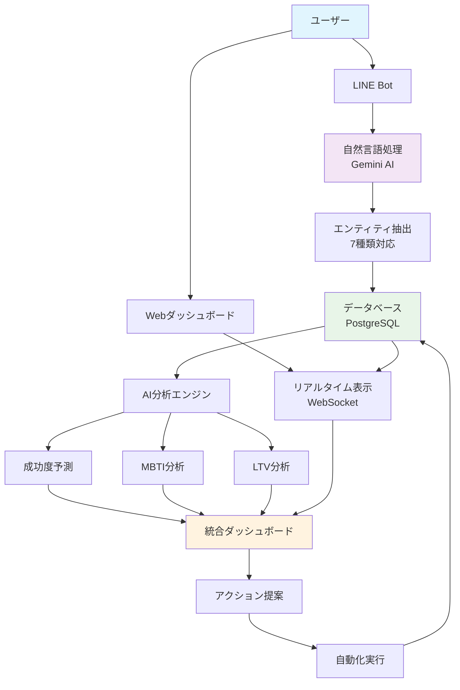
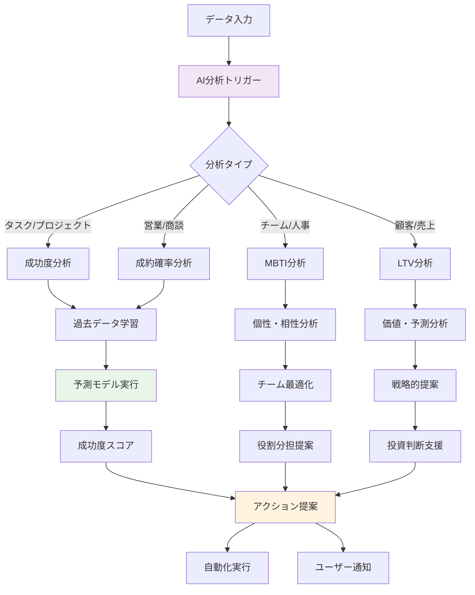
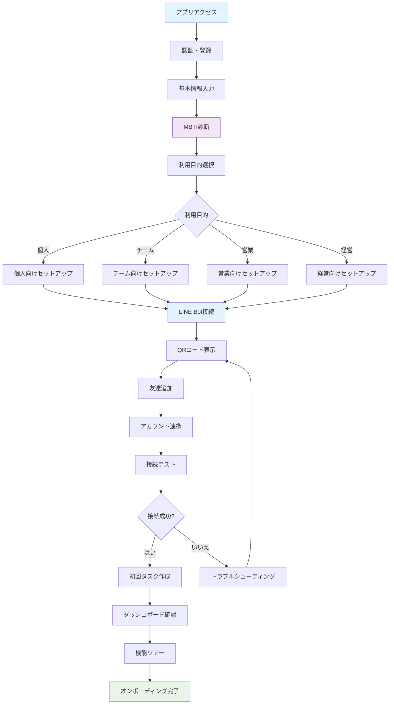
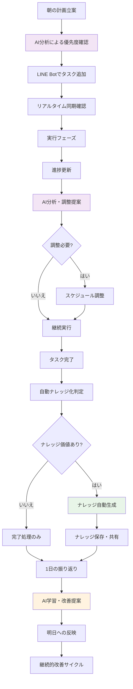
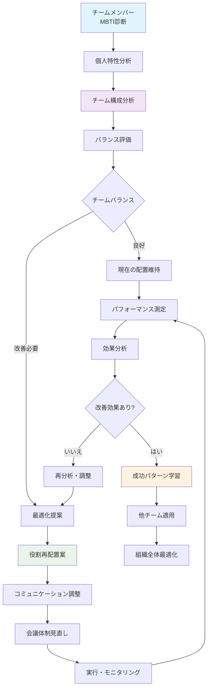
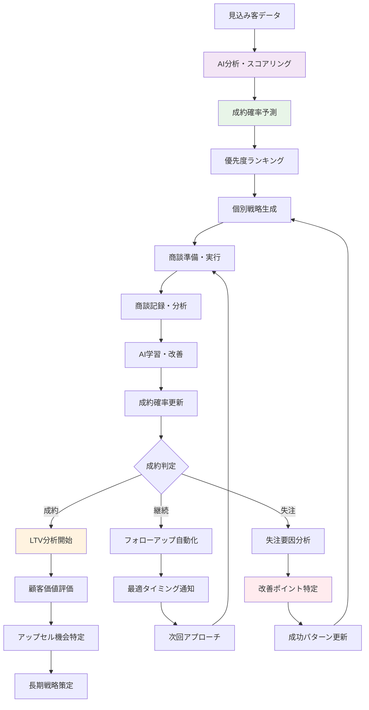
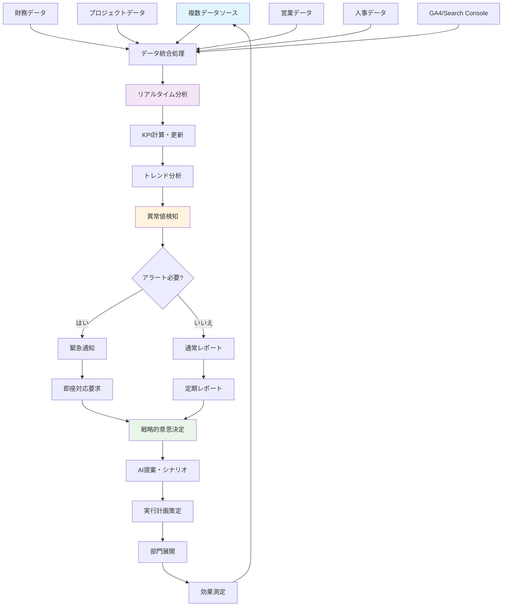
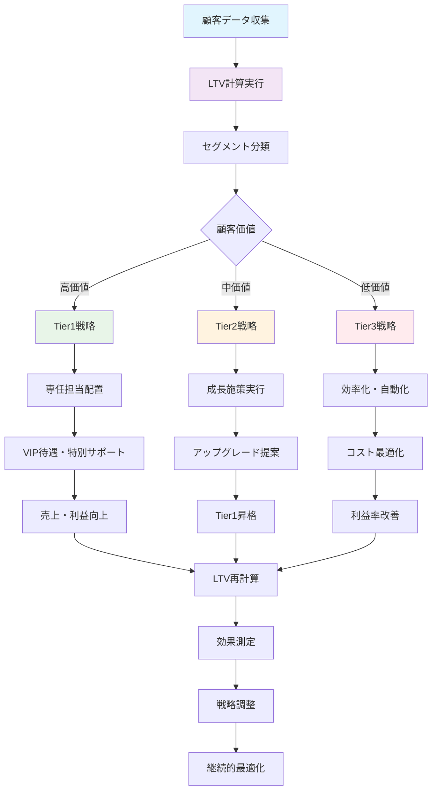
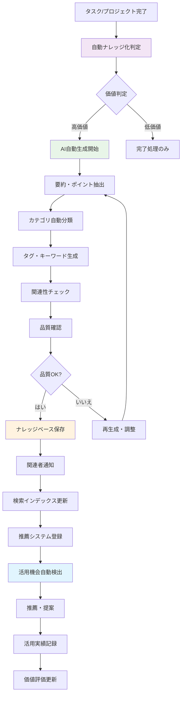
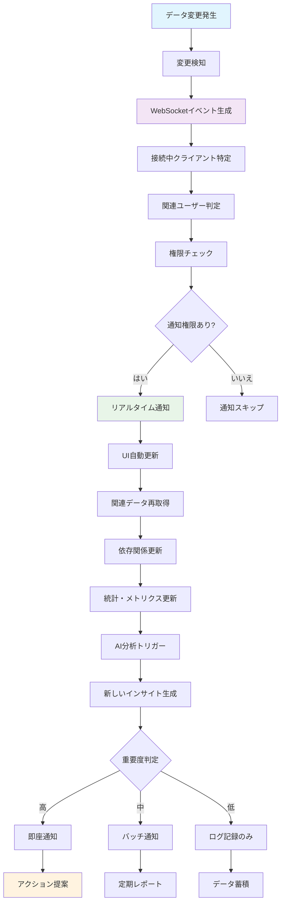

# Find To Do Management App - 視覚的フロー図集

## 📊 システム全体統合フロー

### 1. 全体アーキテクチャ・データフロー



### 2. LINE Bot統合処理フロー

```mermaid
graph TD
    A[LINEメッセージ受信] --> B{メンション検出}
    B -->|@find-todo検出| C[コマンド判定]
    B -->|メンション なし| D[通常処理終了]
    
    C --> E{既存セッション?}
    E -->|あり| F[セッション継続処理]
    E -->|なし| G[新規AI処理開始]
    
    G --> H[Gemini AI解析]
    H --> I[エンティティ抽出]
    I --> J{完全な情報?}
    J -->|はい| K[データ保存]
    J -->|いいえ| L[セッション作成]
    
    L --> M[不足情報確認]
    M --> N[段階的入力開始]
    N --> O[ユーザー応答待ち]
    O --> F
    
    F --> P[情報補完]
    P --> Q{完了?}
    Q -->|はい| K
    Q -->|いいえ| N
    
    K --> R[WebSocket通知]
    R --> S[ダッシュボード更新]
    S --> T[完了通知送信]
    
    style A fill:#e3f2fd
    style H fill:#f3e5f5
    style K fill:#e8f5e8
    style S fill:#fff3e0
```

### 3. AI分析・予測プロセスフロー



## 🔄 ユーザーエクスペリエンスフロー

### 4. 新規ユーザーオンボーディングフロー



### 5. 日常利用・最適化フロー



## 👥 チーム・組織フロー

### 6. MBTI活用チーム最適化フロー



### 7. 営業成果最大化フロー



## 📈 経営・戦略フロー

### 8. 統合経営ダッシュボードフロー



### 9. LTV分析・戦略決定フロー



## 🔄 自動化・統合フロー

### 10. ナレッジ自動生成・活用フロー



### 11. リアルタイム統合・同期フロー



---

これらの視覚的フロー図により、Find To Do Management Appの複雑な統合システムと各機能の相互作用を直感的に理解し、最適なユーザー体験を設計・実現できます。